# Aplicativo para o seu celular

<h4>Você que já utiliza a nossa plataforma, já pensou em um acesso mais rápido, e tudo isso na palma da sua mão?</h4>

Por isso disponibilizamos aqui o link direto para a página do aplicativo <b>Safe2Pay</b> para instalar em seu <b>Smartphone</b>, tanto <b>Android</b> quando <b>iOS</b>. 

<table style="width:60%; Height:100%; margin-left: auto; margin-right: auto;">
<tr>
<th style="border:2px solid #002F4D;">Android</th>
<th style="border:2px solid #002F4D;">iOS</th>
</tr>
<td style="border:2px solid #002F4D;"></td>
<td style="border:2px solid #002F4D;"></td>
</table>

*Para baixar o aplicativo basta você clicar na imagem acima.*

Em seu <b>Aplicativo</b> você terá uma utilização limitada para os perfis <b>Administradores</b> da conta, ou algum perfil <b>Personalizado</b> com permissão de acesso aos serviços do APP.

# Conhecendo o aplicativo

<h3>Início</h3>
Ao acessar o aplicativo e realizar login em sua conta, a primeira tela que você visualizará será este menu.

Neste menu você tens algumas informações como: 
<b>Total de Vendas</b> - Este valor é referente as <b>transações efetivadas</b> no dia atual; 
<b>Quantidade Paga</b> - Aqui você identificará a quantidade de <b>transações que foram autorizadas</b>; 
<b>Compras Abertas</b> - Aqui o número é referente a quantidade de transações <b>ainda pendentes</b>; 
<b>Ultimas Transações</b> - Você ainda pode visualizar as <b>últimas transações geradas</b>. 

<table style="width:60%; Height:100%; margin-left: auto; margin-right: auto;">
<tr>
<td rowspan="3" style="border:2px solid #002F4D;">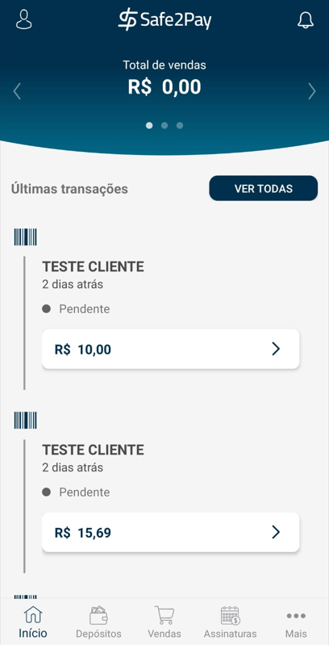</td>
<td style="border:2px solid #002F4D;">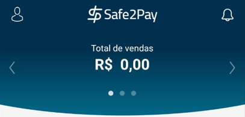</td>
</tr><tr>
<td style="border:2px solid #002F4D;">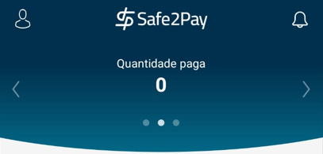</td>
</tr><tr>
<td style="border:2px solid #002F4D;">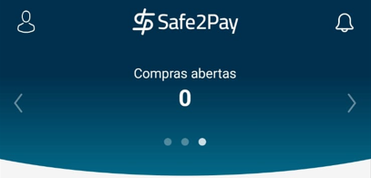</td>
</tr>
</table>

<h3>Depósitos</h3>
Neste menu você poderá visualizar a sua <b>"Conta Corrente"</b> de forma mais resumida.

Logo que você acessar este menu, as primeiras informações disponíveis serão os <b>repasses do mês atual</b>, caso você queria visualizar mais informações sobre seu <b>Saldo</b>, basta apertar no <b>Cifrão</b>.

Após clicar no Cifrão você será direcionado ao menu de <b>Saldo</b>, aqui você terá informações como: 
<b>Recebimento no mês</b> - O valor total de recebimentos do mês em que você selecionou; 
<b>Previsto no mês</b> - O valor previsto para o mês; 
<b>Total a receber</b> - Esse será o valor que ainda esta pendente para ser repassado; 
<b>Cancelamentos/Contestações</b> - Aqui aparece o valor total das transações estornadas e também das transações que foram contestadas; 
<b>Banco</b> - Aqui você terá as informações da conta bancária onde seu repasse será enviado. 

<table style="width:60%; Height:100%; margin-left: auto; margin-right: auto;">
<td style="border:2px solid #002F4D;">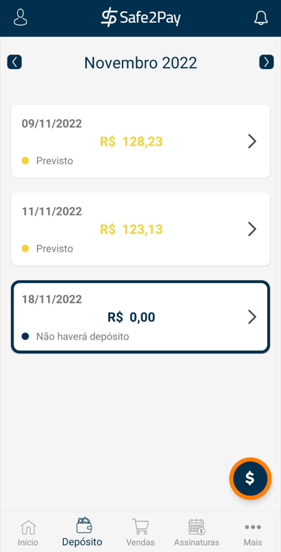</td>
<td style="border:2px solid #002F4D;">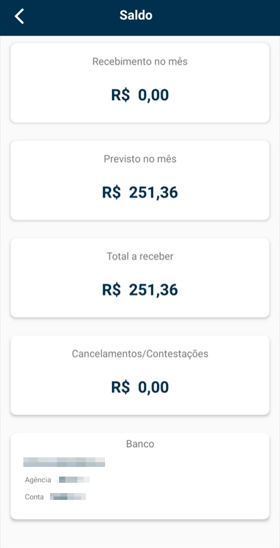</td>
</table>

<h3>Vendas</h3>
Ao acessar o menu de <b>Vendas</b> em seu aplicativo, você visualizará as suas últimas <b>Vendas Avulsas</b>.

Apertando no <b style="font-size: 17px;">(+)</b> será aberto um menu para gerar uma nova transação, onde deverão ser preenchencidas: 
<b>Informações do Cliente</b> - Nome, CPF ou CNPJ, Email e caso queria pode enviar a cobrança via SMS; 
<b>Informações do Produto/Serviço</b> - Descrição da Cobrança, Valor e caso queira determinar uma data para a expiração deste cobrança; 
<b>Escolha a forma de pagamento</b> - Basta selecionar as formas que você irá disponibilizar para o seu cliente pagar.

<table style="width:60%; Height:100%; margin-left: auto; margin-right: auto;">
<tr>
<td rowspan="3" style="border:2px solid #002F4D;">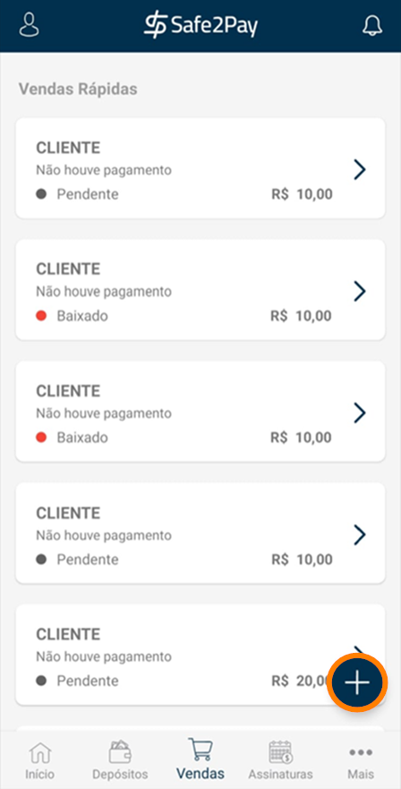</td>
<td style="border:2px solid #002F4D;">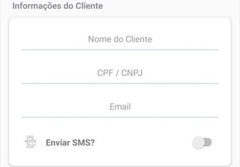</td>
</tr><tr>
<td style="border:2px solid #002F4D;">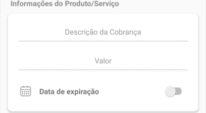</td>
</tr><tr>
<td style="border:2px solid #002F4D;">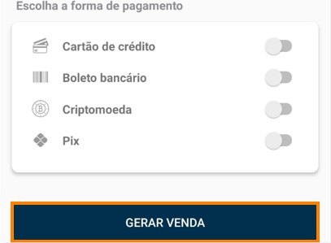</td>
</tr>
</table>

<h3>Assinaturas</h3>
Aqui você poderá visualizar todas as <b>Assinaturas</b> de seus clientes e o <b>status</b> atual dela, além de poder <b>criar uma assinatura</b>.

Pressionando no <b style="font-size: 17px;">(+)</b> será aberto um menu para gerar uma nova assinatura, onde deverão ser preenchencidas: 
<b>Informações do Cliente</b> - Nome, CPF ou CNPJ e o Email; 
<b>Plano</b> - Você deverá selecionar um de seus planos <b>já existentes</b>; 
<b>Escolha a forma de pagamento</b> - Basta selecionar a forma que você deseja que seu cliente pague.

<table style="width:60%; Height:100%; margin-left: auto; margin-right: auto;">
<td style="border:2px solid #002F4D;">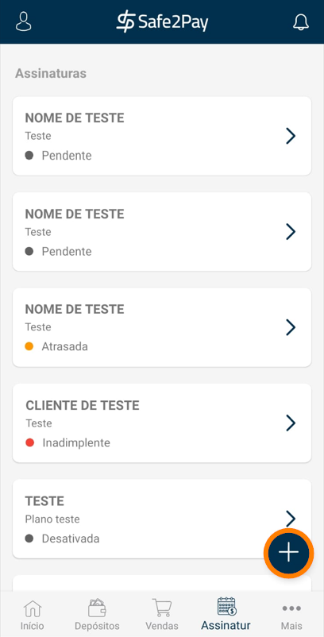</td>
<td style="border:2px solid #002F4D;">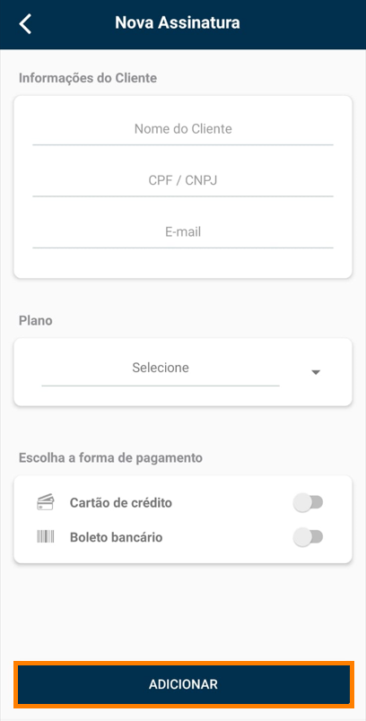</td>
</table>

   <h3>Mais...</h3>
   Aqui terão alguns menus a mais para a visualização: 
   Como a <b>Calculadora de Parcelas</b>,<b>Subcontas</b> e <b>Usuários</b> cadastrados em sua conta.  
   

   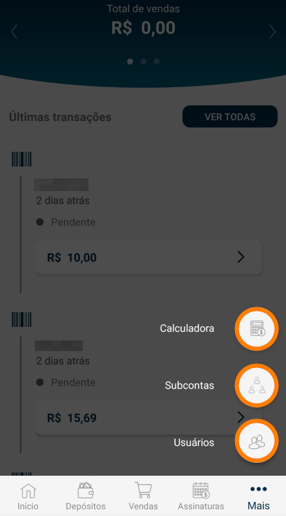
   

     
   <h3>Subcontas</h3>
   Caso você tenha o modelo de perfil Marketplace, neste menu você poderá visualizar as suas <b>Subcontas</b>:  
   

   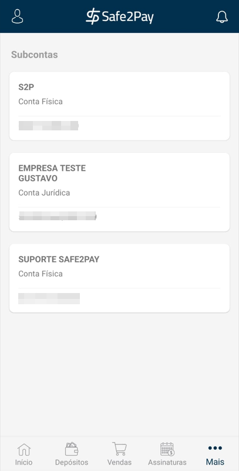
   

   <h3>Calculadora</h3>
   Neste Menu você terá acesso à <b>Calculadora de Parcelas</b>. 
   Atualmente a calculadora só divide o valor no número máximo de parcelas configurado.  
   

    <table style="width:519px; Height:475px;">
    <td style="border:2px solid #002F4D;">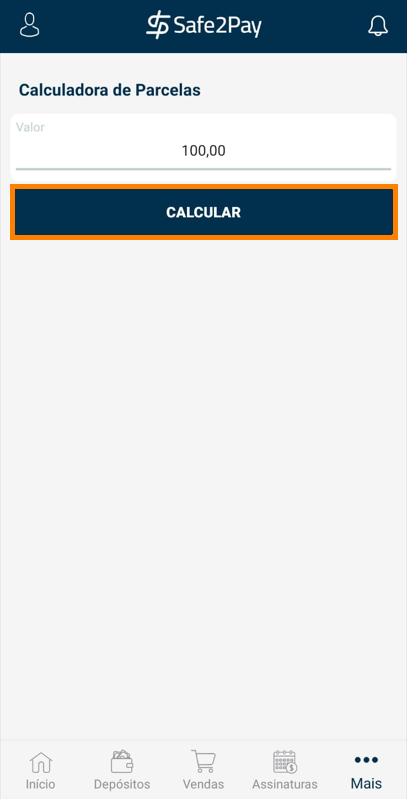</td>
    <td style="border:2px solid #002F4D;">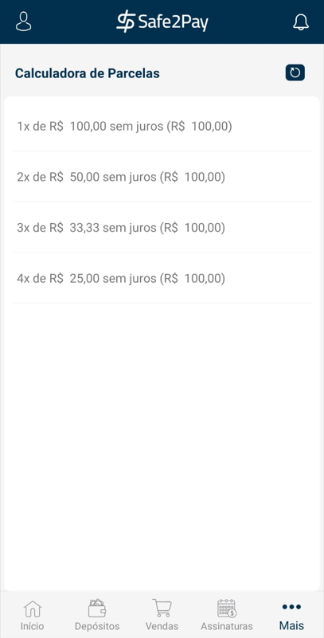</td>
    </table>
    

     
    <h3>Usuários</h3>
    Aqui você poderá visualizar todos os seus <b>Usuários</b> cadastrados em sua conta, além de poder adicionar um novo usuário pressionando o botão <b style="font-size: 17px;">(+)</b>.  
    

    <table style="width:519px; Height:475px;">
    <td style="border:2px solid #002F4D;">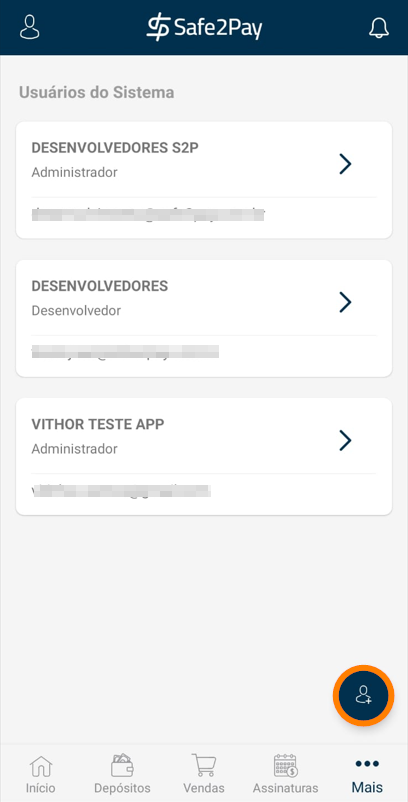</td>
    <td style="border:2px solid #002F4D;"></td>
    </table>
    

<my-footer></my-footer>