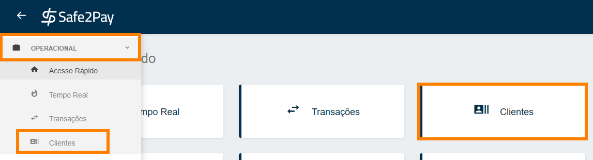

# Cadastrando clientes

Agora iremos demonstraremos como <b>cadastrar</b> clientes em sua conta.

Você pode acessar o menu <b>Clientes</b> através de nosso <b>Acesso Rápido</b> ou através do <b>Menu Lateral</b> acessando a aba <b>Operacional</b>.

Para <b>cadastrar</b> o seu cliente é necessário clicar no símbolo de <b style="font-size: 17px;">(+)</b> no canto inferior direito da tela, conforme imagem abaixo.

Agora o sistema informa duas opções de como você pode incluir seus clientes. 

Adicionando cada cliente <b>manualmente</b>, onde você irá incluir os dados pelo painel da safe2pay ou por <b>arquivo CSV</b>, quando há uma grande quantidade de clientes a ser incluído.

<b style="font-size: 20px;">1º opção: Manual</b>

Seguindo da forma <b>manual</b> para o cadastro do cliente, aparecerá a tela conforme imagem abaixo. 

Aqui serão solicitados os dados do cliente que você deseja cadastrar, assim que preenchidos basta clicar em <b>salvar</b>.

<b style="color:#FF7F00;">Sempre lembrando que todos os campos com (*) são obrigatórios.</b>

<b style="font-size: 20px;">2º opção: Importar CSV</b>

Se você decidir por <b>importar CSV</b>, aparecerá a tela conforme imagem abaixo. 
Nesta tela temos a explicação do que deve conter na <b>planilha CSV</b>. 

<b>Você pode baixar um exemplo da planilha </b><a target="_blank" href="https://filesadmin.blob.core.windows.net/files/layout-cliente-lote.csv">clicando aqui!</a>

Quando estiver com a planilha pronta conforme as instruções, clique em <b>Enviar CSV</b>. 
Após o envio você verá uma tela conforme a imagem a baixo.

Aqui você visualizará as informações de seus clientes que foram importadas, caso você verifique algum erro você pode utilizar o botão <b>Voltar</b>, além pode <b>Adicionar</b> outra planilha CSV. Para salvar os clientes importados basta clicar em <b>Salvar</b> que todos clientes serão salvos.

<my-footer></my-footer>