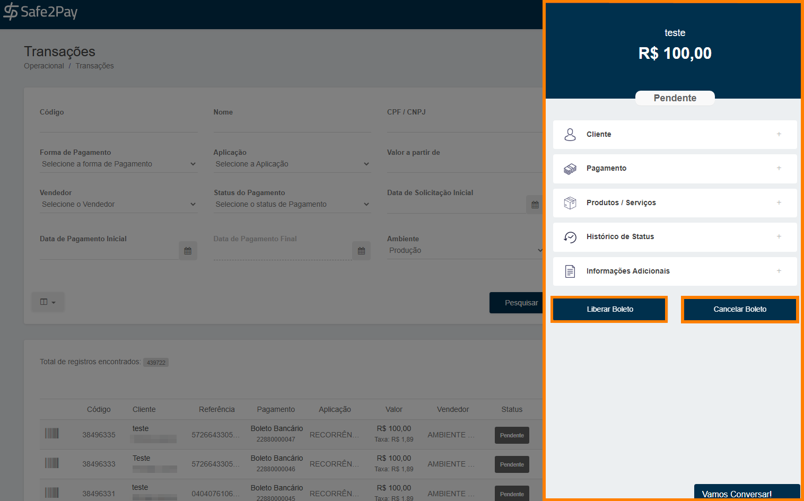

# Cancelando um boleto bancário

Mostraremos como você poderá realizar o <b>Cancelamento</b> ou a <b>Liberação</b> de um boleto, caso seja necessário. 
Para isso você deverá acessar o menu <b>Transações</b> através do atalho no <b>Acesso Rápido</b> ou através do <b>Menu Lateral</b> acessando a aba <b>Operacional</b>.

E então você irá localizar a transação do boleto ao qual deseja <b>cancelar</b> ou <b>liberar</b>.

Aparecerá um menu no lado lateral direito da tela com as informações sobre a transação, onde você deverá clicar em <b>Cancelar</b> Boleto.

E confirmar o cancelamento, logo após confirmar aparecerá uma mensagem confirmando, e o boleto será atualizado para o status de <b>"Em Cancelamento"</b>.

Caso você deseje realizar a <b>Liberação</b> do boleto, o processo é o mesmo, só que ao invés de cancelar o boleto será atualizado para o status <b>Liberado</b>.

<my-footer></my-footer>