# Conhecendo o sistema

<b style="font-size: 20px;">Bem-vindo à nossa plataforma!</b>

Ao acessar sua conta no Safe2Pay é apresentado o <b>Acesso Rápido</b>, onde é possível visualizar de uma forma rápida as principais funcionalidades do sistema.

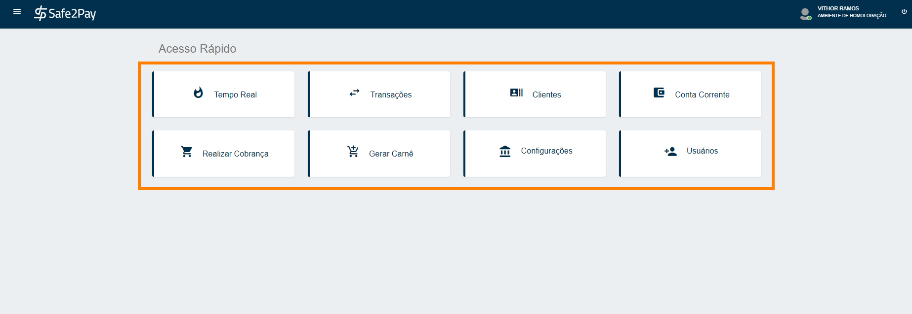

<b>Tempo Real:</b> Aqui você encontra em tempo real o valor total das vendas realizadas no dia, semana, mês e até mesmo nos três meses anteriores. Além de um gráfico com as principais formas de pagamento efetuadas nas cobranças.

<b>Transações:</b> Nesta opção é possível visualizar todos os registros das suas transações e seus status, que podem ser:
<table style="width:100%; Height:100%; table-layout:fixed; border:3px double #002F4D">
<td><b>"Pendente"</b> - a transação ainda está aguardando pagamento.</td>
<td><b>"Processamento"</b> - sistema identificou o pagamento, mas a transação ainda não foi liquidada.</td>
<td><b>"Autorizado"</b> - sistema identificou o pagamento, da transação.</td>
<tr><td><b>"Em disputa"</b> - Quando o cliente contesta a venda no cartão de crédito com a operadora, próximo status se confirmado é o Chargeback.</td>
<td><b>"Devolvido"</b> - Valor da transação foi devolvida.</td>
<td><b>"Baixado"</b> - somente para Boletos, eles são baixados automaticamente quando expira a data de vencimento.</td></tr>
<tr><td><b>"Recusado"</b> - em pagamentos com cartões, o status aparece em casos de dados ausentes ou quando não há pagamento até a data final.</td>
<td><b>"Liberado"</b> - A transação foi liberada por um usuário, entretanto até o momento não foi paga.</td>
<td><b>"Em cancelamento"</b> - quando o cancelamento é solicitado manualmente ou ter chego no prazo de baixa.</td></tr>
<td><b>"Cancelado"</b> - quem realiza esta ação é o vendedor.</td>
<td><b>"Chargeback"</b> -  A transação não foi reconhecida pelo titular do cartão.</td>
<td><b>"Pré-Autorizado"</b> -  A transação foi pré-autorizada no cartão de crédito do cliente. É necessário realizar a captura para finalizar a cobrança.</td>
</table>

<b>Cliente:</b> Aqui você pode adicionar clientes e gerencia-los.

<b>Conta Corrente:</b> Nesta opção você visualiza seus depósitos recebidos e os valores previstos a receber.

<b>Realizar Cobrança:</b> Aqui você cria vendas avulsas e gerência as formas de pagamento.

<b>Gerar Carnê:</b> Nesta opção você pode inserir os dados do cliente, as informações presentes no boleto, e ainda definir se irá gerá-lo em lote ou mensalmente.

<b>Configurações:</b> Em configurações você encontra seus dados cadastrais e de recebimento, consegue gerenciar as formas de recebimento de acordo com seu negócio, habilitar/desabilitar antifraude e notificações por SMS, seu logotipo, notificações que deseja enviar ou não para todos os clientes e encontra informações para integrar a Safe2Pay com outra plataforma caso deseje.

<b>Usuários:</b> Aqui você consegue adicionar, editar ou remover usuários do seu perfil, podendo ser eles administradores, vendedores, sócios e até personalizar.

No canto superior direito da tela, é possível visualizar o <b>nome do usuário</b> de acesso à conta e a <b>razão social</b> da empresa.

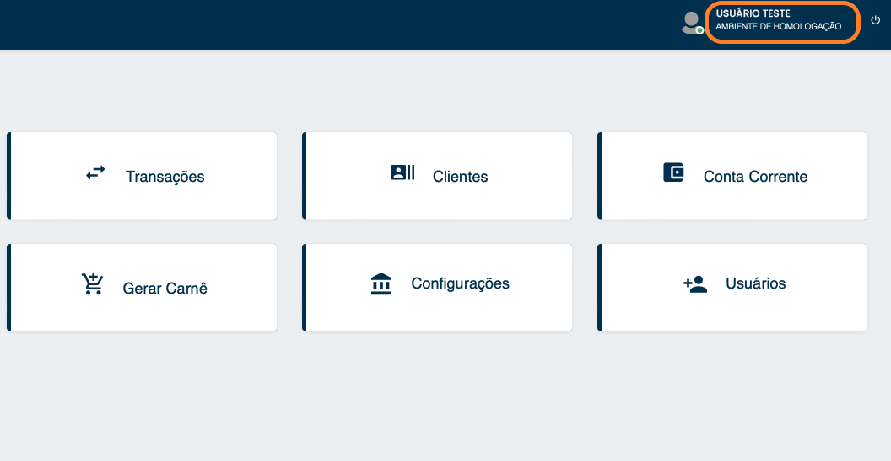

Ao clicar em cima destas informações, teremos as seguintes opções de <b>Alterar a senha</b> ou <b>Gerenciar Dispositivos</b>.

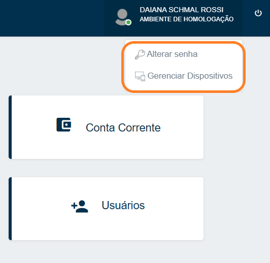

No canto superior direito da tela, temos o botão para <b>sair do sistema</b> sempre que necessário.

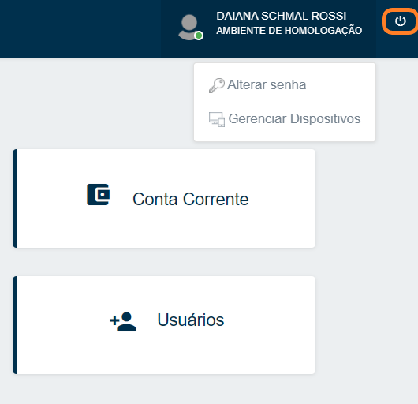

E no canto inferior direito, temos o acesso ao nosso <b>Suporte Técnico</b> especializado para lhe orientar no que for necessário.

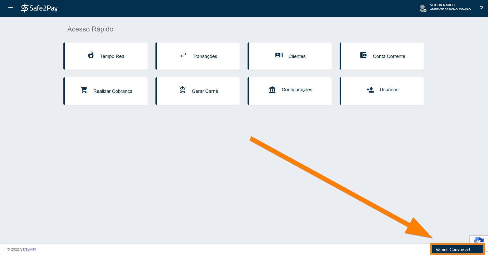

Por fim, e bastante usual no canto superior esquerdo da tela possuímos o <b>Menu do sistema</b>, também chamado de <b>"Menu Lateral"</b>.

Basta clicar nos três risquinhos, e então aparecerá o menu com todas as suas funcionalidades.

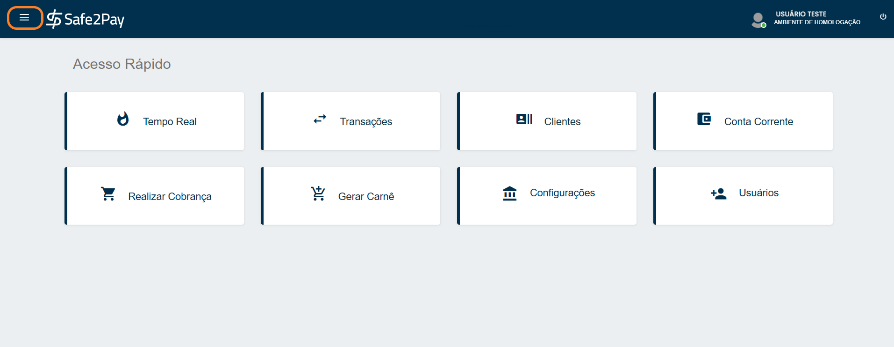
<!-- Cadastro de Recebimento !-->

<b style="font-size: 20px;">Como configurar os seus dados bancários para recebimento:</b>

Acessando o menu de <b>Dados de Recebimento</b>, você deverá informar uma conta bancária que tenha vínculo ao <b>CPF/CNPJ de cadastro</b> em nosso sistema, além de informar a forma em que você deseja receber, como receber <b>Todos os Dias (exceto feriados bancários)</b>, <b>Semanalmente</b> quanto <b>Mensalmente</b> (Você pode determinar o dia do que mês que tem preferencia para o recebimento).

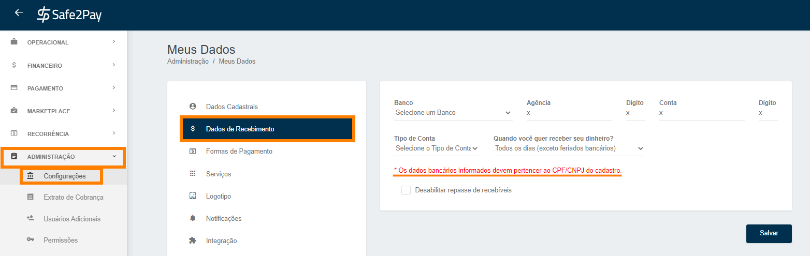

<b style="color: #FF7F00;">*Caso a conta bancária informada não tenha vínculo com o CPF/CNPJ cadastrado em sua conta, o repasse não será efetivado.</b>
<!-- FIM Cadastro Recebimento!-->
<!-- Formas de Pagamentos !-->
<b style="font-size: 20px;">Configurando as formas de pagamento</b>:

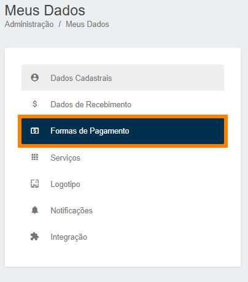
  
<select onchange="document.getElementById('preview').src = this.value" style="display:block; margin-left: auto; margin-right: auto; height: 30px; border-style:none none solid none; border-color: #002F4D;">

<option hidden>Selecione a forma de pagamento:</option>
<option value="../imagens/formaBol01.png">Boleto</option>
<option value="../imagens/formaCard01.png">Cartão de Crédito</option>
<option value="../imagens/formaCrip.png">Criptomoeda</option>
<option value="../imagens/formaPIX.png">PIX</option>
</select>
  

 
<table style="border:1px solid #002F4D; display:block; margin-left: auto; margin-right: auto; width:895px;">
<tr><td><b>Boleto:</b> 
Você pode selecionar o <b>layout</b> que deseja ter em seu <b>boleto</b>; 
Definir o <b>layout</b> do boleto em seus <b>carnês</b>; 
Aceitar que o pagamento seja feito com valor divergente do registrado no boleto <b>(mais utilizado para receber doações)</b>; 
Aceitar que o pagamento do boleto seja feito <b>após seu vencimento</b>; 
Definir qual será o <b>prazo</b> para que seja feita a <b>baixa automática</b>; 
Os itens abaixo você pode <b>definir como padrão</b> para as suas cobranças <b>ou se deseja configurar manualmente em cada transação gerada</b>; 
<b style="color: #FF7F00;">IMPORTANTE: O Banco aceita no mínimo 1 dia e no máximo 99 dias após o vencimento.</b></td></tr>

<tr><td><b>Cartão de Crédito:</b> 
Selecione o <b>número de parcelas</b> que você quer oferecer em sua loja, o <b>máximo</b> de parcelas permitidas é <b>12</b>; 
<b>Valor mínimo</b> de parcelamento permitido é de <b>R$ 5,00</b>; 
Configurar o <b>texto</b> que aparece na <b>fatura do cartão do cliente</b>; 
<b style="color: #FF7F00;">IMPORTANTE: Informe algo que seja de fácil entendimento, assim o cliente entenderá na fatura do seu cartão qual compra foi realizada.</b></td></tr>

<tr><td><b>Criptomoedas:</b> 
Nessa tela, é possível <b>habilitar</b> ou <b>desabilitar</b> a forma de pagamento.</td></tr>

<tr><td><b>PIX:</b> 
Nessa tela, é possível <b>habilitar</b> ou <b>desabilitar</b> a forma de pagamento.</td></tr>
</table>
<b style="color: #FF7F00;">IMPORTANTE: não esqueça de clicar em Salvar.</b>
<!-- FIM formas de pagamentos !-->

<!-- Serviços !-->
<b style="font-size: 20px;">Serviços Adicionais.</b>

Caso tenha interesse, você pode configurar serviços adicionais como <b>SMS</b> e <b>Anti-Fraude</b>:

A opção de <b>SMS</b> tem o objetivo de um envio de cobrança mais prático ao seu cliente. 
<b>Este serviço tem uma taxa fixa de R$0,20.</b>

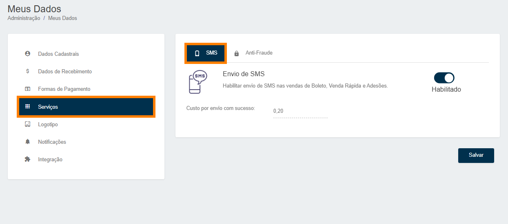

Nosso serviço de <b>Anti-Fraude</b>, é para transações em cartões de crédito. Por questões de segurança recomendamos deixar ativo <b>100%</b> do tempo para evitar ao máximo suas chances receber um <b>Chargeback</b>. 
<b>Este serviço tem uma taxa fixa de R$0,50.</b>

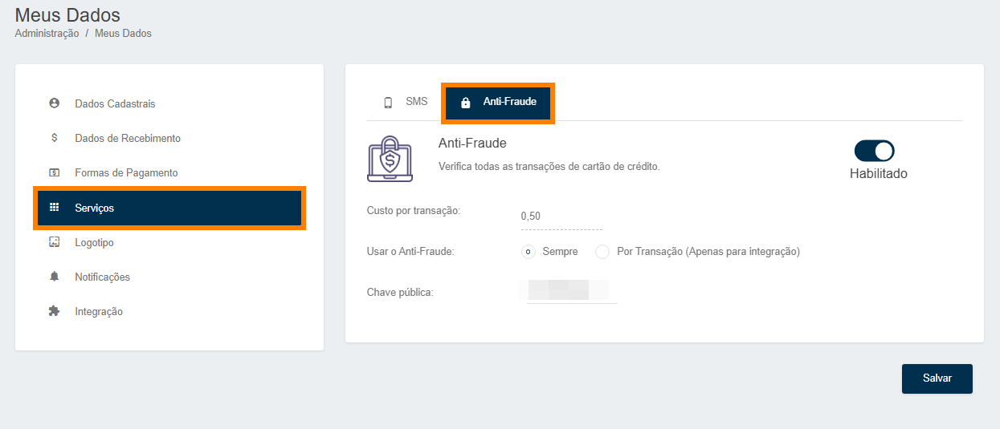 
<b style="color: #FF7F00;">*Ao desativar o antifraude, você está assumindo o risco de Chargeback.</b>

<!-- FIM serviços !-->
<!-- Configure a sua logotipo !-->
<b style="font-size: 20px;">Configurar o seu logotipo.</b> 
Única exigência é que a imagem possua 100x40 Pixels.

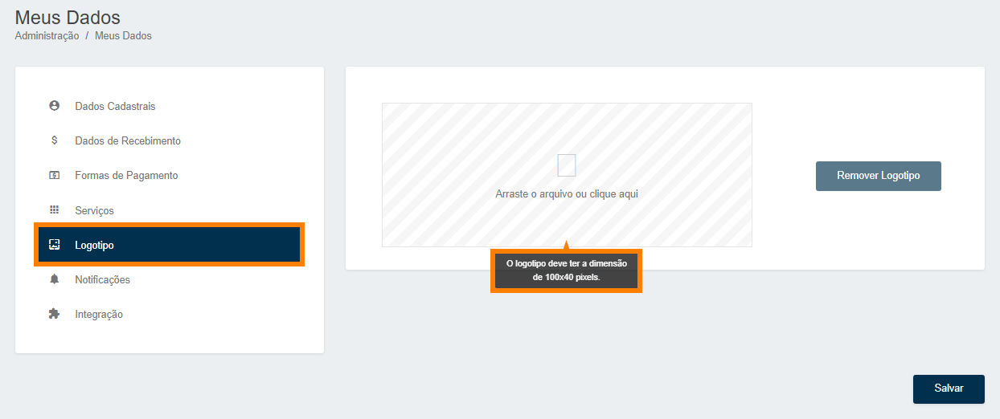

<!-- FIM Logotipo !-->
<!-- Notificações !-->
<b style="font-size: 20px;">Notificações opcionais:</b>

<table style="width:76.5%; Height:100%; border:3px double #002F4D; margin-left: auto; margin-right: auto; border-collapse: collapse;">
<tr><th>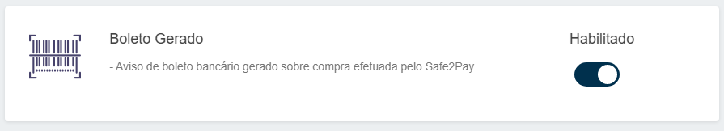</th></tr>
<tr><th>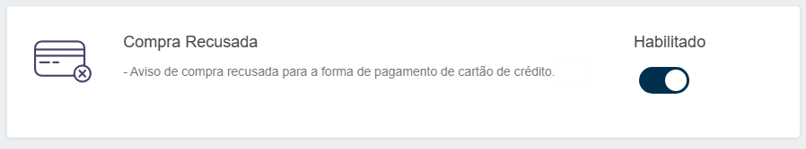</th></tr>
<tr><th>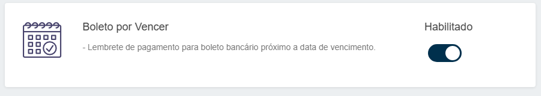</th></tr>
<tr><th>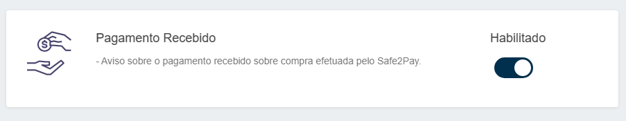</th></tr>
<tr><th>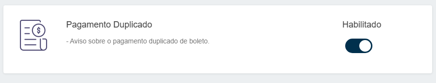</th></tr>
<tr><th>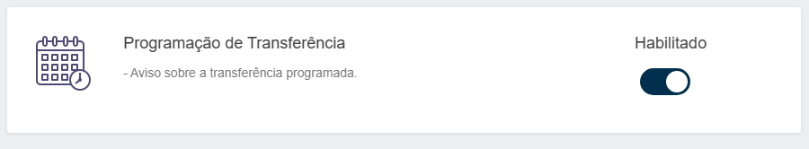</th></tr>
<tr><th>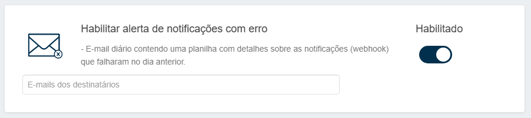</th></tr>
</table>
<!-- FIM notificações !-->

<b style="font-size: 25px;">Agora pronto, seu sistema está pronto para uso.</b>

<my-footer></my-footer>