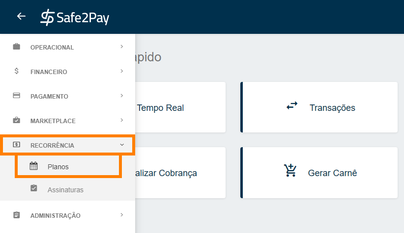
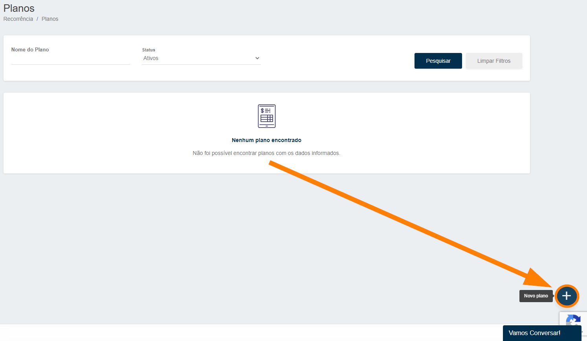
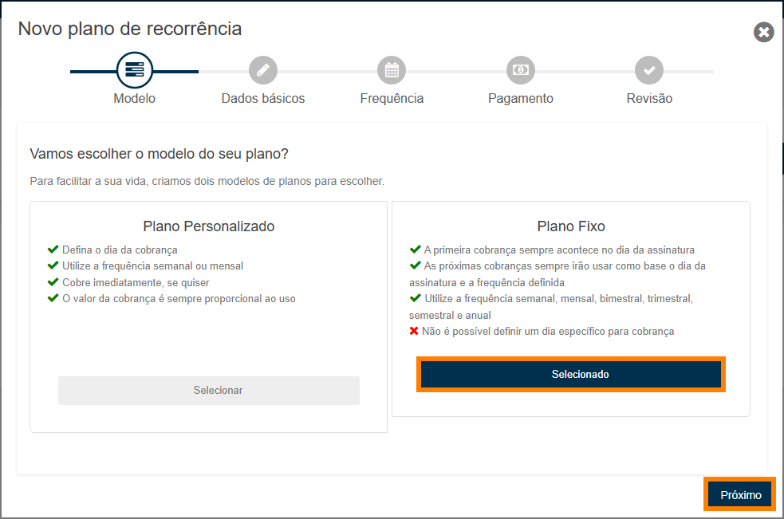
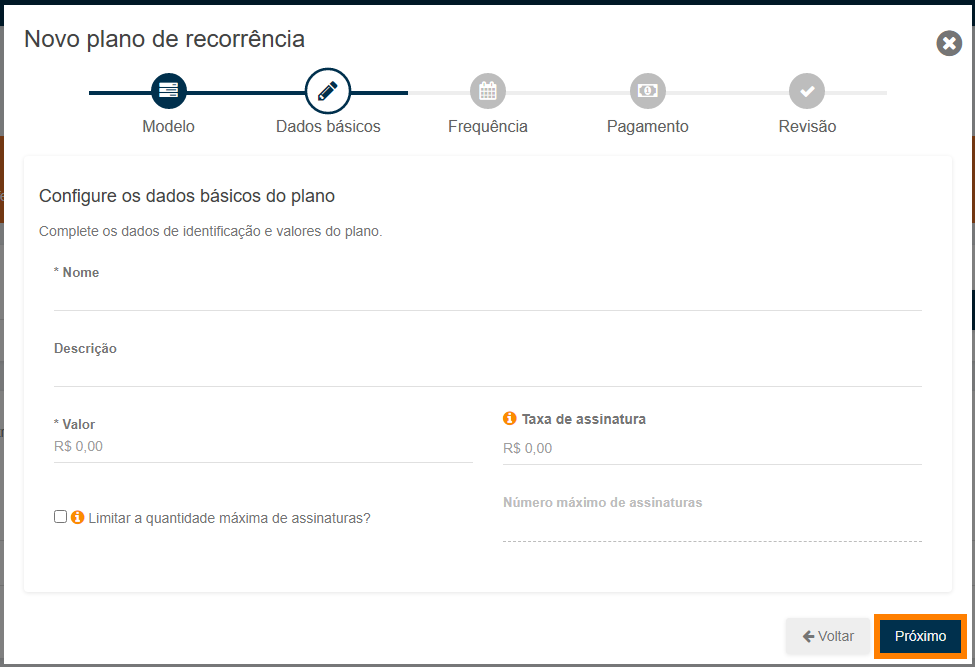
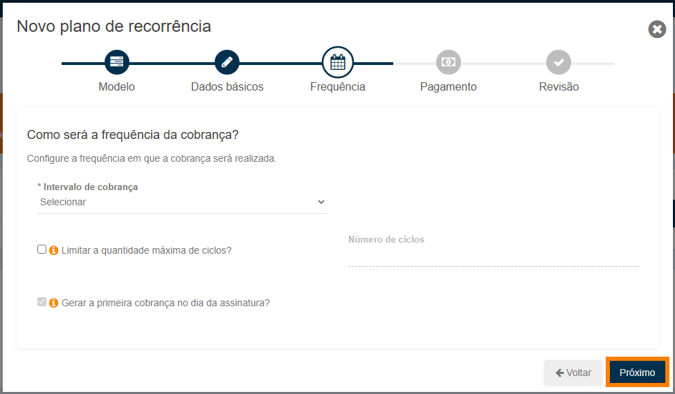
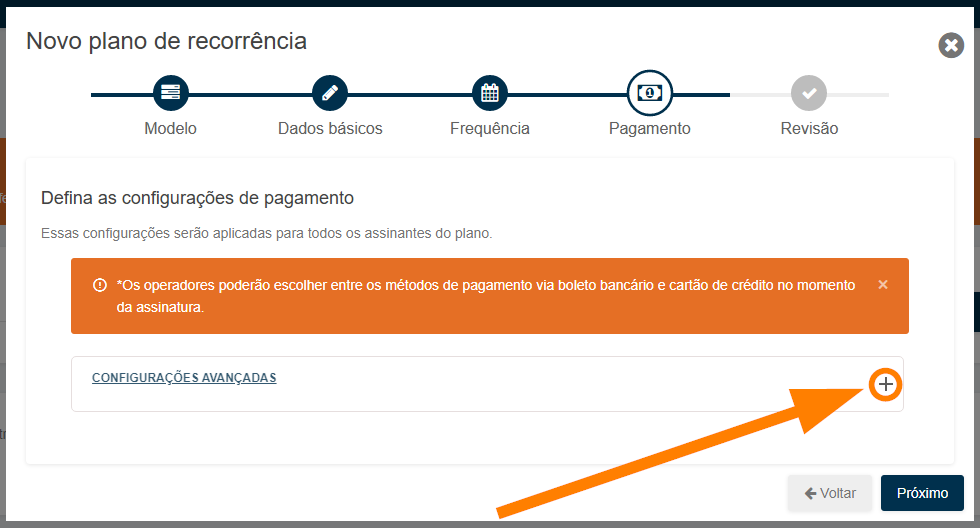
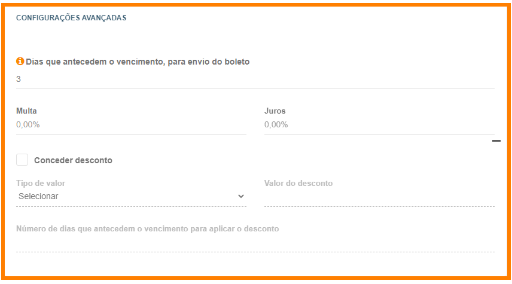
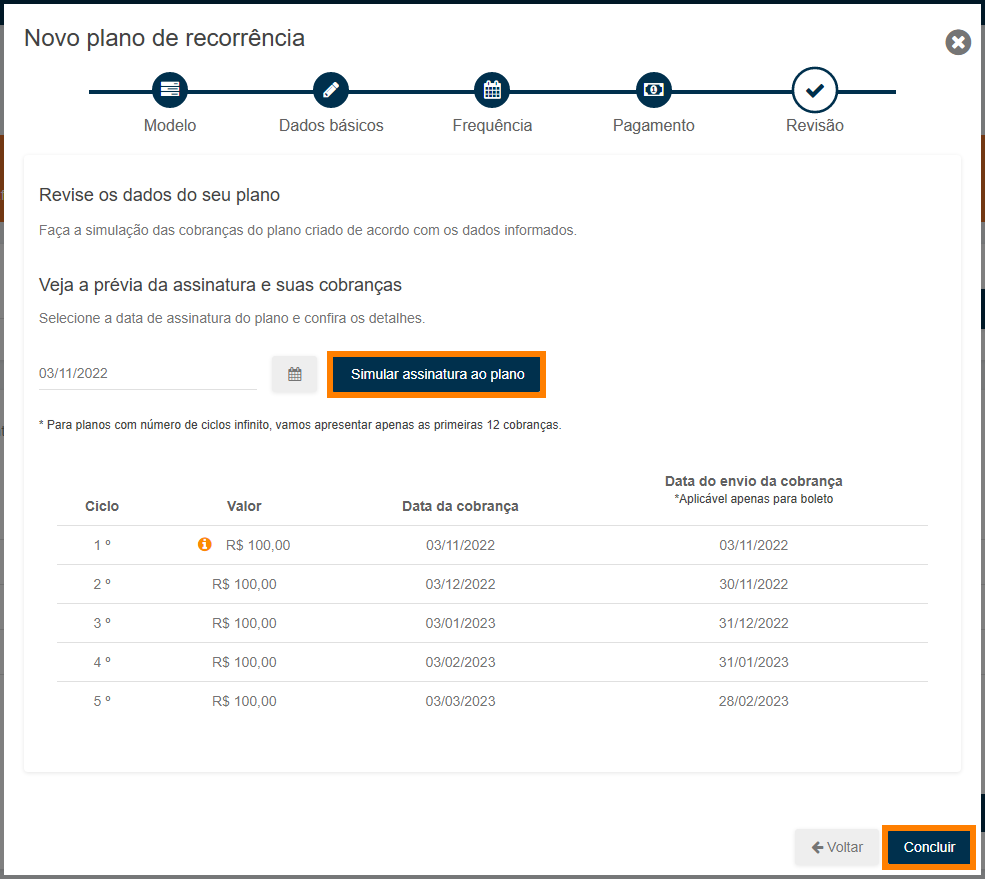

# Criando um plano fixo

Para criar um <b>Plano</b> no modelo <b>Fixo</b>, primeiramente será necessario entrar no menu <b>Planos</b>, você pode localiza-lo acessando o <b>Menu Lateral</b>,depois abra a opção <b>Recorrência</b>, e selecione a aba <b>Planos</b>.

A seguir será necessário clicar no botão de <b>Novo Plano</b><b style="font-size: 17px;">(+)</b> no canto inferior direito da tela, conforme ilustrado abaixo.

Então chegou o momento de personalizar o seu plano. 
Neste momento o sistema informa duas opções de modelo para criação.

<b style="font-size: 35px;">Plano fixo</b>

Este é um modelo de plano onde:

A primeira cobrança <b>sempre acontecerá no dia da assinatura</b>. 
As próximas cobranças sempre irão usar como base <b>o dia da criação assinatura e a frequência definida</b>. 
Poderá ser definido a frequência <b>semanal, mensal, bimestral, trimestral, semestral e anual</b>. 
<b style="color: #FF7F00;">Não será possível definir um dia específico para cobrança neste modelo de plano.</b>

Após selecionar o melhor modelo para seu plano e assinaturas, clique em <b>Próximo</b> e então seguimos com as configurações.

<b style="font-size: 18px;">Dados básicos</b>

Neste segundo momento, definiremos:

<b style="font-size: 16px;">Nome (obrigatório) –</b> Nomenclatura do plano. 
<b style="font-size: 16px;">Valor (obrigatório) –</b> Valor fixo a ser cobrado nas cobranças. 
Descrição (<b>opcional</b>) – Referência ao plano criado, opcional. 
Taxa de adesão (<b>opcional</b>) – Se a empresa cobrará taxa para a assinatura deste plano, será cobrado somente na primeira cobrança. 
Limitar a Quantidade de assinaturas (<b>opcional</b>) – Para limitar um número máximo de assinaturas que farão parte de plano. 

Após configurar os dados básicos do plano, clique em <b>Próximo</b> e então seguimos com as configurações.

<b style="font-size: 18px;">Frequência</b>

<b style="font-size: 16px;">Intervalo de Cobrança (obrigatório) -</b> Define o intervalo da cobrança, por exemplo: <b>mensal</b>. 
Limitar a quantidade máxima de ciclos (<b>opcional</b>) – Possibilidade de limitar um número máximo de cobranças, por exemplo: <b>100 ciclos serão 100 cobranças</b>. 
Gerar a primeira cobrança no dia da assinatura (<b>Fixo</b>) – Define se a primeira cobrança será no dia da configuração do plano ou no dia da assinatura, ou seja, <b>cobrança imediata</b>. 

Caso opte por cobrar no <b>dia da assinatura</b>, isso significa que a cobrança será gerada <b>imediatamente</b>.  
Então o cliente que assinar, vai receber uma cobrança proporcional ao tempo que assinou, o que chamamos de <b>Pro Rata</b>.

Por exemplo, supondo que o seu plano é <b>mensal</b>, com data de cobrança no <b>dia 20</b>, mas você quer que seja feita a <b>cobrança imediata</b>. Se o seu cliente <b>assinar o plano no dia 25</b>, será feita o cálculo de <b>Pro Rata</b>, para ser cobrado um <b>valor proporcional</b>.

Após configurar a frequência do plano, clique em <b>Próximo</b> e então seguimos com as configurações.

<b style="font-size: 18px;">Pagamento</b>

Caso deseje realizar configurações avançadas para a assinatura em Boleto, será necessário clicar no símbolo de <b style="font-size: 17px;">(+)</b>, conforme imagem abaixo.

<b style="color: #FF7F00;">IMPORTANTE: Neste momento é definido algumas configurações avançadas da assinatura em boleto, portanto a forma de pagamento será escolhida apenas no momento de criar a assinatura.</b>

<b>Dias que antecedem o vencimento para envio do boleto -</b> Quantidade de dias anteriores a data de vencimento em que o cliente receberá um e-mail com o boleto que está próximo ao vencimento. 
<b>Juros e Multa</b> – Definição de juros e multa que serão cobrados.

<b>Conceder Desconto</b> 
<b>Tipo de valor -</b> Se o desconto será percentual ou em valor. 
<b>Valor do desconto -</b> Valor ou percentual definido para o desconto. 
<b>Dias para desconto -</b> Quantidade de dias para desconto antes do vencimento. 

E então após concluídas todas as configurações passaremos a revisão do plano criado.

<b style="font-size: 18px;">Revisão</b>

Será possível visualizar as <b>principais definições</b> e a <b>simulação do plano</b>.

Na simulação identificamos o valor de cobrança do primeiro ciclo com Pro Rata caso tenha sido optado por <b>Gerar a primeira cobrança no dia da assinatura</b>, ou seja o valor proporcional a assinatura. 
*(Neste caso por se tratar de um Plano Fixo a primeira cobrança será sempre no dia da assinatura)*

Estando tudo certo com a criação, é só clicar em <b>Concluir</b> e o plano estará criado e pronto para <b>receber assinaturas</b>.

 

# [Agora você pode criar uma assinatura para vincular ao seu Plano](CentralDeAjuda/pages/NovaAssinatura)

<my-footer></my-footer>