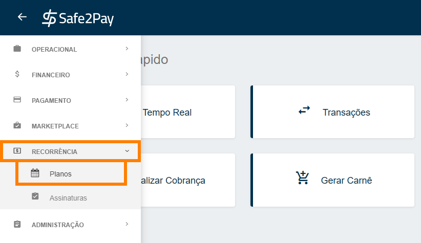
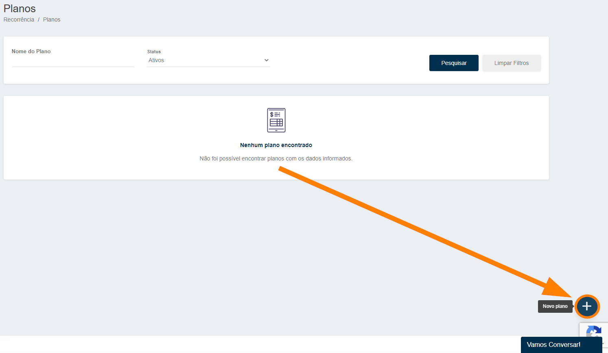

# Criando um plano personalisado

Para criar um <b>Plano</b> desta vez no modelo <b>Personalizado</b>, você deverá acessar o menu <b>Planos</b>, você pode localiza-lo abrindo o <b>Menu Lateral</b>, depois selecione a opção <b>Recorrência</b>, e entre na aba <b>Planos</b>.

A seguir será necessário clicar no botão de <b>Novo Plano</b><b style="font-size: 17px;">(+)</b> no canto inferior direito da tela, conforme ilustrado abaixo.

Então chegou o momento de personalizar o seu plano. 
Neste momento o sistema informa duas opções de modelo para criação.

<b style="font-size: 35px;">Plano Personalizado</b>

Este é um modelo de plano onde é possível definir:

<b>O dia que será cobrado</b> o plano para todas as assinaturas. 
Poderá ser utilizada a frequência <b>semanal ou mensal</b>. 
Tem a possibilidae de <b>cobrar a assinatura no dia que ela foi criada se preferir</b> e então o valor da cobrança ficará sempre proporcional ao uso.

Após selecionar o melhor modelo para seu plano e assinaturas, clique em <b>Próximo</b> e então seguimos com as configurações.

<b style="font-size: 18px;">Dados básicos</b>

Neste segundo momento, definiremos os:

<b style="font-size: 16px;">Nome (obrigatório) –</b> Nomenclatura do plano. 
<b style="font-size: 16px;">Valor (obrigatório) –</b> Valor fixo a ser cobrado nas cobranças. 
Descrição (<b>opcional</b>) – Referência ao plano criado, opcional. 
Taxa de adesão (<b>opcional</b>) – Se a empresa cobrará taxa para a assinatura deste plano, será cobrado somente na primeira cobrança. 
Limitar a Quantidade de assinaturas (<b>opcional</b>) – Para limitar um número máximo de assinaturas que farão parte de plano. 

Após configurar os dados básicos do plano, clique em <b>Próximo</b> e então seguimos com as configurações.

<b style="font-size: 18px;">Frequência</b>

<b style="font-size: 16px;">Intervalo de Cobrança (obrigatório) -</b> Define o intervalo da cobrança, por exemplo: <b>semanal</b>. 
<b style="font-size: 16px;">Dia do Vencimento da Cobrança (obrigatório) –</b> Define o dia da cobrança do plano.

<b>Por exemplo:</b> 
Se a forma de pagamento for <b>cartão de crédito será descontado na fatura do cliente neste dia</b>, porém caso seja <b>boleto bancário, este será o dia do vencimento</b>.

Limitar a quantidade máxima de ciclos (<b>opcional</b>) – Possibilidade de limitar um número máximo de cobranças, por exemplo: <b>50 ciclos serão 50 cobranças</b>. 
Gerar a primeira cobrança no dia da assinatura (<b>opcional</b>) – Define se a primeira cobrança será no dia da configuração do plano ou no dia da assinatura, ou seja, <b>cobrança imediata</b>.

Caso opte por cobrar no <b>dia da assinatura</b>, isso significa que a cobrança será gerada <b>imediatamente</b>.  
Então o cliente que assinar, vai receber uma cobrança proporcional ao tempo que assinou, o que chamamos de <b>Pro Rata</b>.

Após configurar a frequência do plano, clique em <b>Próximo</b> e então seguimos com as configurações.

<b style="font-size: 18px;">Pagamento</b>

Caso deseje realizar configurações avançadas para a assinatura em Boleto, será necessário clicar no símbolo de <b style="font-size: 17px;">(+)</b>, conforme imagem abaixo.

<b style="color: #FF7F00;">IMPORTANTE: Neste momento é definido algumas configurações avançadas da assinatura em boleto, portanto a forma de pagamento será escolhida apenas no momento de criar a assinatura.</b>

<b>Dias que antecedem o vencimento para envio do boleto -</b> Quantidade de dias anteriores a data de vencimento em que o cliente receberá um e-mail com o boleto que está próximo ao vencimento. 
<b>Juros e Multa –</b> Definição de juros e multa que serão cobrados.

E então após concluídas todas as configurações passaremos a revisão do plano criado.

<b style="font-size: 18px;">Revisão</b>

Será possível visualizar as <b>principais definições</b> e a <b>simulação do plano</b>.

Na simulação identificamos o valor de cobrança do primeiro ciclo com Pro Rata caso tenha sido optado por <b>Gerar a primeira cobrança no dia da assinatura</b>, ou seja o valor proporcional a assinatura.

Estando tudo certo com a criação, é só clicar em <b>Concluir</b> e o plano estará criado e pronto para <b>receber assinaturas</b>.

 

# [Agora você pode criar uma assinatura para vincular ao seu Plano](pages/NovaAssinatura)

<my-footer></my-footer>
