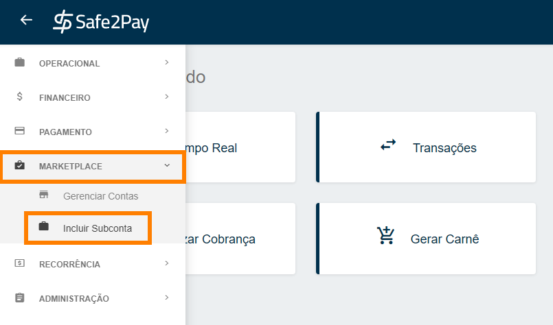
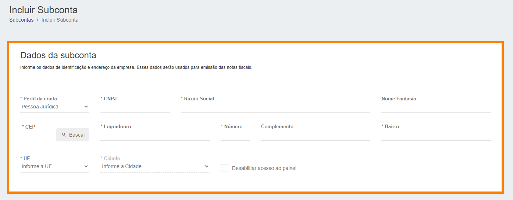
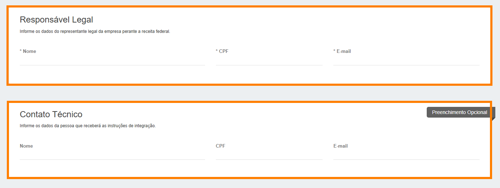
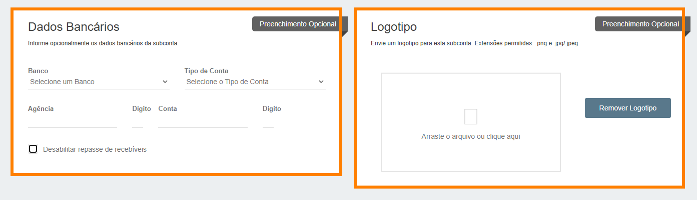
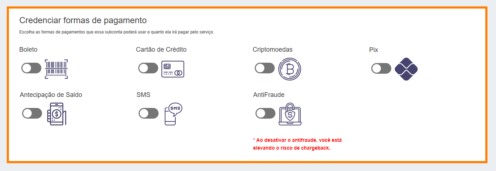
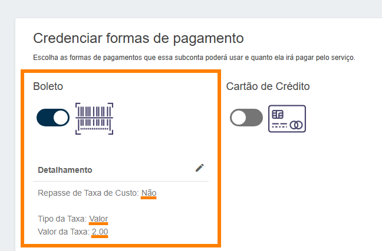
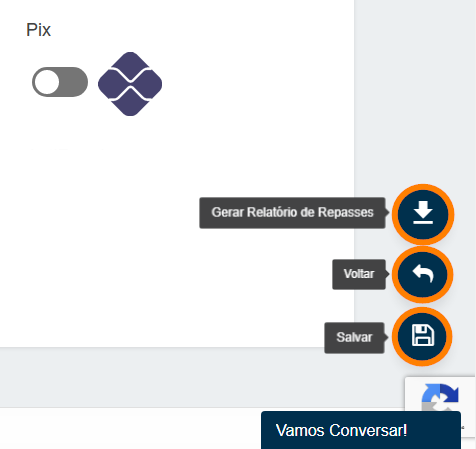

# Criando Subconta

Para criar uma <b>Subconta</b> será necessário acessar o menu <b>Marketplace</b> e logo após acessar o menu <b>Incluir Subconta</b>, conforme apresentamos na imagem abaixo.

A seguir será necessário preencher todas as informações da criação da <b>Subconta</b>: 
As primeiras informações solicitadas aqui são os dados referente a empresa. 
<b style="color: #FF7F00; font-size:18px">Todos os campos com (*) são obrigatórios.</b>

<b>IMPORTANTE: Temos a opção de dar acesso restrito ao painel para esta Subconta, basta marcar o checkbox com esta informação.</b>

Abaixo, serão solicitadas algumas informações do <b>responsável legal</b> pela empresa perante a <b>Receita Federal</b>. 
Além de um <b>contato técnico</b> totalmente opcional.

Após, será possível informar os <b>dados bancários</b> e uma <b>logo</b> para Subconta, caso seja de interesse do <b>Marketplace</b>. 
Estes campos são de preenchimento opcional e poderão ser preenchidos pelo responsável pela empresa posteriormente.

O próximo passo é credenciar as <b>formar de pagamento</b> que esta Subconta poderá usar. 
Todas as formas de pagamento abaixo podem ser Habilitadas ou Desabilitadas, depende do interesse do <b>Marketplace</b>.

*Recomendamos fortemente a utilização do serviço de antifraude para evitar chargebacks*

Ao Habilitar, cada opção de pagamento aparecerá a imagem abaixo.

<select onchange="document.getElementById('preview1').src = this.value" style="display:block; margin-left: auto; margin-right: auto; height: 30px; border-style:none none solid none; border-color: #002F4D;">

<option hidden>Selecione a forma de pagamento:</option>
<option value="../imagens/TaxaSub01.png">Boleto</option>
<option value="../imagens/TaxaSub02.png">Cartão de Crédito</option>
<option value="../imagens/TaxaSub03.png">Criptomoeda</option>
<option value="../imagens/TaxaSub04.png">PIX</option>
<option value="../imagens/TaxaSub05.png">Antecipação de Saldo</option>
</select>
 

<b style="font-size: 20px;">1ª Opção - Repassar o valor da taxa para a Subconta</b>

Para isso basta marcar o checkbox, neste caso,<b> a nota com o valor da taxa que estamos cobrando será emitida contra a subconta</b>.

<b style="font-size: 20px;">2ª Opção - Para não repassar a taxa para Subconta</b>

Para isso você não deverá marcar o checkbox e incluir no campo "taxa em valor/percentual" o valor que deseja repassar para a subconta, <b>neste caso a nota sobre a taxa cobrada será emitida contra a conta do Marketplace.</b>

Após definir a taxa de cada forma de pagamento, basta clicar em <b>Salvar Taxas</b>. 
*Exemplo boleto:*

Assim que todas as formas de pagamentos estiverem informadas e as taxas definidas, basta clicar em <b>Salvar</b> no canto inferior direito da tela.

<b style="font-size: 25px;">Pronto, a Subconta está criada.</b>

<my-footer></my-footer>