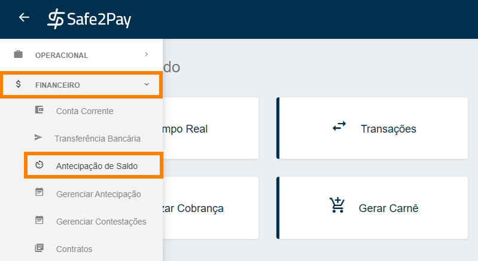
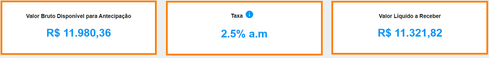
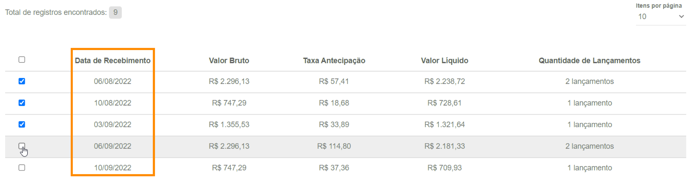
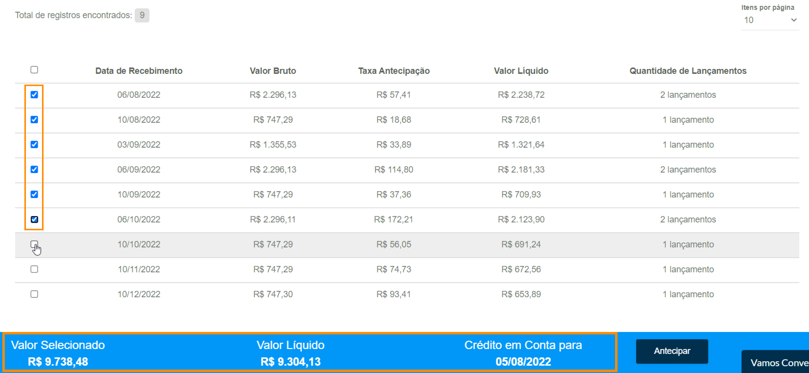
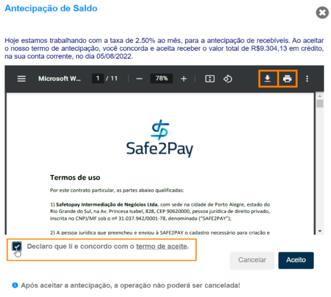

# Entendendo a antecipação

A antecipação de saldo é um adiantamento dos recebíveis previstos, que permite às empresas receberem valores antes do prazo programado.  
Uma funcionalidade disponível em todas as empresas especializadas neste modelo de operação.

<table><td>
<b>Informações importantes:</b>
<i>Por meio da Resolução n°4.734 e da Circular n°3.952, o Conselho Monetário Nacional e o Banco Central do Brasil realizaram modificações importantes nas operações de crédito de estabelecimentos que utilizam recebíveis de cartões como garantia. Com a mudança, toda vez que uma compra for feita com cartão de crédito ou débito, as credenciadoras precisam registrar essas transações nas registradoras.</i>
</td></table>

<b>Mas como funciona a antecipação de saldo na Safe2Pay?</b> 
Para antecipar os recebíveis, é necessário estar no mínimo 03 meses transacionando em cartão de crédito na plataforma. Após esse prazo, faremos uma análise no histórico de sua conta e em sua documentação jurídica.

Você pode antecipar seus recebíveis de cartão de crédito por uma <b>taxa de 2,5% do total da transação ao mês</b>.

A solicitação da antecipação dos recebíveis poderá ser realizada em qualquer horário <b>(24 horas)</b> inclusive <b>fins de semana e feriados</b>. As solicitações de antecipação serão creditadas no <b>próximo dia útil</b>.

Disponibilizamos no menu lateral, um submenu chamado <b>“Financeiro > Antecipação de Saldo”</b>, nesta tela você terá a opção de solicitar a antecipação total ou parcial dos recebíveis das vendas, que foram realizadas em cartão de crédito.

A página de antecipação de recebíveis, irá mostrar o <b>valor bruto</b>, a <b>taxa em porcentagem (%)</b> que será descontada e o <b>valor líquido</b> a ser recebido, caso a antecipação seja efetivada...

<i>O cálculo para a taxa de antecipação é feito a partir da soma de cada parcela adicionada para compor o valor desejado. Além do número de dias entre a data do pagamento e a data que será feito o crédito em conta do valor a ser antecipado.</i>

Na sequência, você tem uma <b>lista de todos os recebíveis programados</b>, que estarão agrupados e ordenados pela data prevista de recebimento, onde o usuário administrador poderá selecionar quais dias de recebíveis deseja realmente antecipar.

Conforme você seleciona qual ou quais datas deseja antecipar, conseguirá visualizar em um <b>pop-up</b>, no rodapé, os valores que foram marcados para antecipação, com o valor bruto total de todos selecionados, o valor líquido a ser creditado e a data do crédito, que será sempre no próximo dia útil.

Ao clicar em <b>"Antecipar"</b>, irá aparecer um termo de antecipação, onde o <b>administrador solicitante</b>, ao aceitar, <b>declara que está de acordo com os valores e taxas acordadas no momento da solicitação de antecipação dos recebíveis</b>.

<b style="color: #FF7F00;">*OBSERVAÇÃO: Você tem a possibilidade de realizar o download do termo clicando na seta apontada para baixo</b>

Após aceitar o termo de aceite, marcando o checkbox, irá aparecer um pop-up confirmando que a solicitação de antecipação de saldo foi finalizada com sucesso.

<b style="font-size: 25px;">Em caso de transações indisponíveis...</b> 
Os valores estão sujeitos a alterações mediante a possíveis transações indisponíveis por contestações ou estornos que podem acontecer em tempo real no momento da solicitação.

No caso deste evento ocorrer, o sistema através de um pop-up irá informar, para que o solicitante tenha ciência do ocorrido, como na imagem abaixo:

Caso <b>todos os lançamentos</b> estejam indisponíveis, o erro será como mostra a imagem abaixo:

<b style="color: #FF7F00;">*Importante: Após aceitar a antecipação de saldo, a operação não poderá ser desfeita/cancelada.</b>

<my-footer></my-footer>