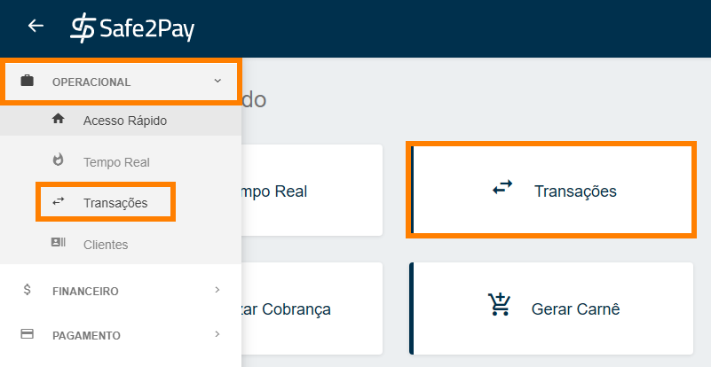
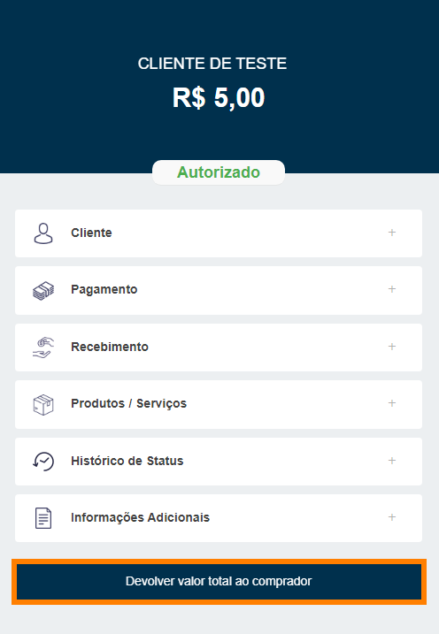
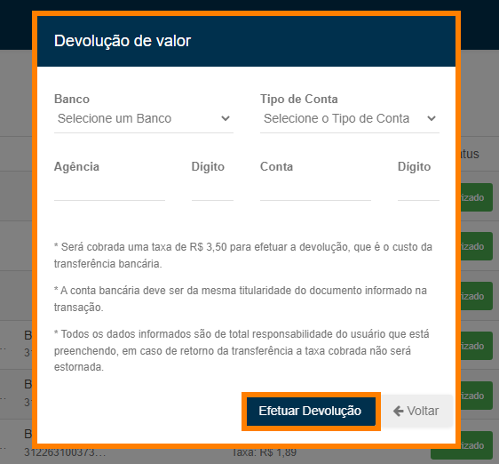
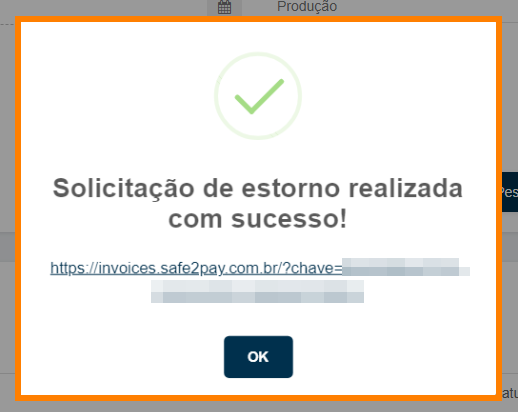
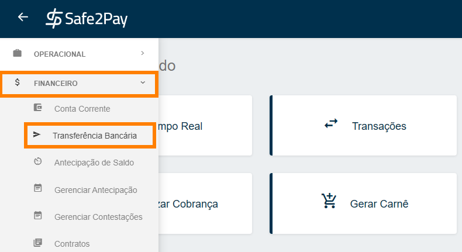
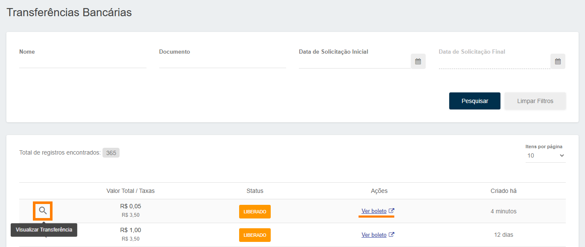

# Como estornar uma transação

Para realizar o estorno de uma transação é bem simples. 
Primeiro você deverá acessar o menu <b>Transações</b> através do atalho no <b>Acesso Rápido</b> ou através do <b>Menu Lateral</b> acessando a aba <b>Operacional</b>.

Caso necessário, você pode aplicar um filtro para localizar a transação desejada. 
Após localizar a <b>Transação desejada</b>, clique na transação, para abrir as informações no painel lateral direito. 

E para estornar a transação basta clicar em <b>Devolver valor total ao comprador</b>. 
Depois você deverá confirmar se deseja de fato estornar esta transação, logo após a transação será atualizada para o status de <b>"Devolvido"</b>. 
<b style="color:#FF7F00;">IMPORTANTE: Após a confirmação do estorno a operação não poderá ser desfeita.</b>

Agora se a forma de pagamento dessa transação for <b>Boleto</b>, siga as instruções abaixo:

1. Você deverá informar os dados bancários vinculados aos dados do cliente <b>que constam no boleto</b>; 
2. Se os dados que constam no boleto do cliente forem um <b>CNPJ</b>, os dados bancários informados devem ser vinculados ao mesmo <b>CNPJ</b>; 
3. Se os dados que constam no boleto do cliente forem um <b>CPF</b>, os dados bancários para o estorno deverão pertencer à <b>Pessoa Física</b> informada. 

<b style="color:#FF7F00;">IMPORTANTE: Se o cliente não possuir conta bancária vinculado as informações do boleto, não será possível realizar o estorno pelo Safe2Pay.</b>

Assim que preenchida todas as informações, basta clicar em <b>Efetuar Devolução</b>, e será mostrado outra janela para confirmação da devolução. 
Após confirmar será gerado um <b>Boleto</b> para você pagar e efetivar a <b>Devolução</b>.

*Será disponibilizado o boleto em um link para você acessar.*

Caso você tenha fechado o aviso com o link para o boleto, você deve seguir o caminho demonstrado abaixo. 
Através do <b>Menu Lateral</b> você deverá acessar a aba de <b>Financeiro</b> e entrar no menu de <b>Transferência Bancária</b>.

Assim que acessar este menu de <b>Transferência Bancária</b>, você terá acesso ao boleto referente ao transação que você deseja <b>Estornar</b>, basta localizar o boleto e realizar o pagamento. 
Além disso, você pode visualizar a transação clicando no ícone de <b>Lupa</b> para confirmar de qual transação se trata.

Por último você irá clicar em <b>Ver Boleto</b> para poder realizar o pagamento do boleto e efetivar a <b>Devolução</b>.

<b style="color:#FF7F00;">IMPORTANTE: Caso exista algum split de pagamento vinculado a esta transação, ele também será estornado.</b>

<my-footer></my-footer>