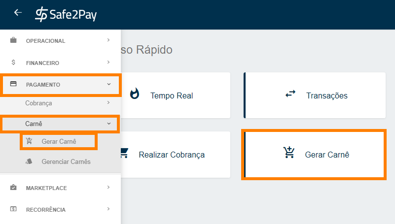
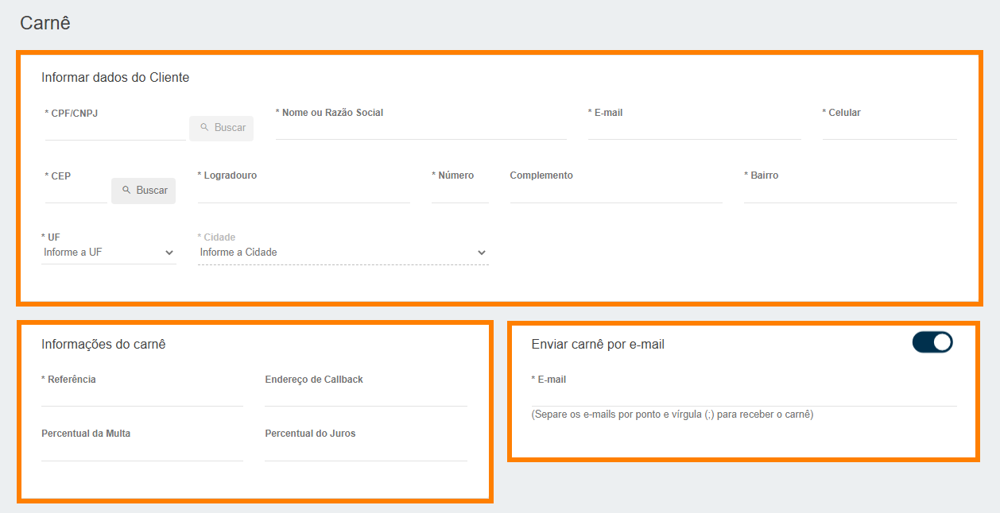
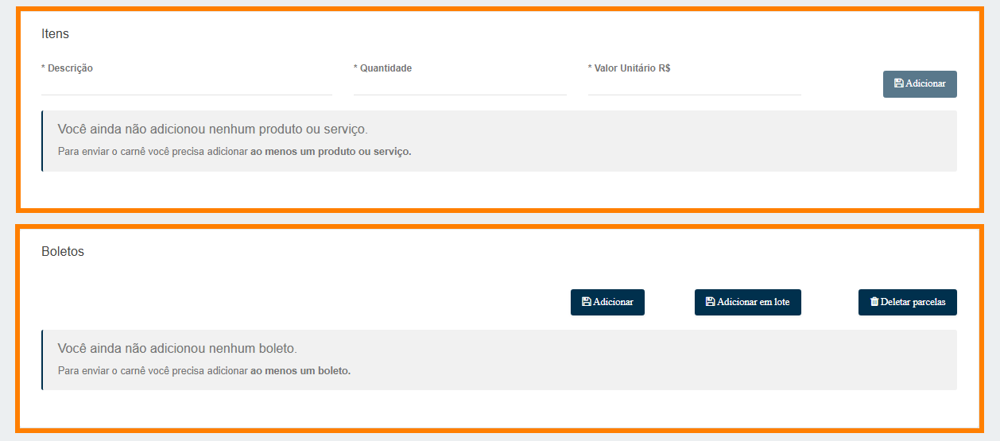
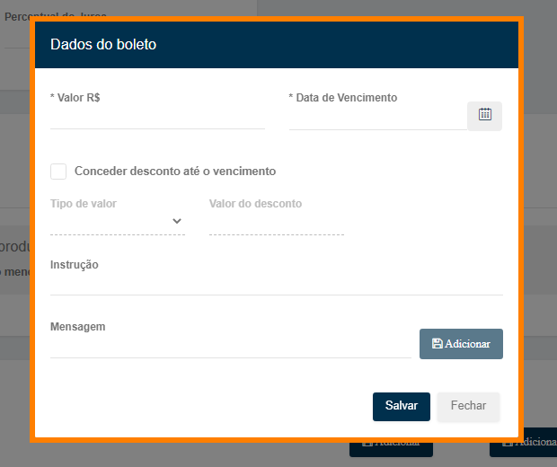
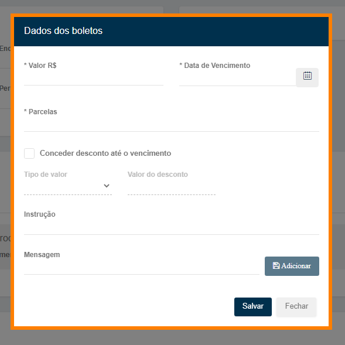
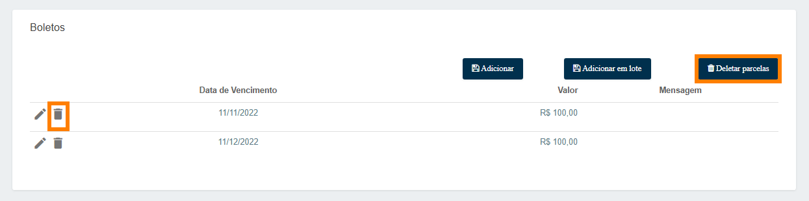
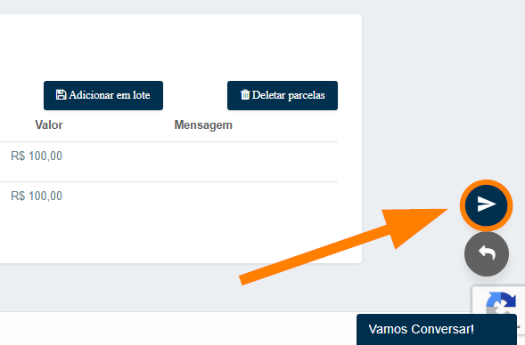
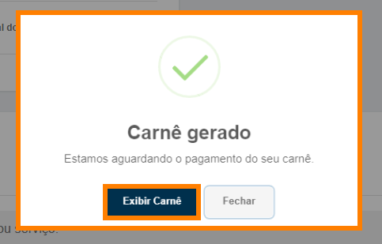

# Gerando carnê

Para criar um carnê você pode acessar o menu <b>Gerar Carnê</b> através do menu de <b>Acesso Rápido</b>, ou conforme a imagem abaixo através do <b>menu lateral</b>.

<b>A seguir, você precisa preencher todas as informações da geração do carnê.</b> 
<b style="color: #FF7F00;"> IMPORTANTE: Apenas os campos que possuem (*) são obrigatórios os preenchimentos.</b>

<b>Informar dados do cliente:</b> As primeiras informações solicitadas aqui são os dados do cliente. 
Caso já tenha o cliente cadastrado, os dados serão preenchidos automaticamente.

<b>Informações do carnê:</b> Logo abaixo, serão solicitadas algumas informações do carnê:
<table style="border: 3px double #002F4D; margin-left: auto; margin-right: auto; border-collapse: collapse; width: 730px;">
<tr><td><b>Referência</b></td>
<td>Identificação da cobrança no sistema, informação não visível no carnê.</td></tr>
<tr><td><b>Endereço de Callback</b></td>
<td>Utilizado em integrações de sistema, para notificações do status do pagamento.</td></tr>
<tr><td><b>Percentual de Multa e Juros</b></td>
<td>Preenchimento para cobrança após o vencimento, caso informado.</td></tr>
</table>

<b>Enviar carnê por e-mail:</b> Após, será possível habilitar ou desabilitar a opção de envio por e-mail. 
Caso seja habilitada a opção de envio, automaticamente o e-mail do cliente aparecerá neste campo. 
É possível incluir mais de um e-mail para recebimento da cobrança, para isso separe os e-mails por <b>(;)</b>.

Logo abaixo das opções anteriores tens mais algumas informações há preencher.

<b>Itens:</b> Nesta opção será solicitada a descrição do <b>produto/serviço</b> que você está vendendo, além da quantidade e valor unitário. Após basta clicar em adicionar.

<b>Boletos:</b> Neste campo serão gerados os boletos desejados para esse carnê, então basta clicar em <b>Adicionar</b>, <b>Adicionar em Lote</b> ou <b>Deletar parcelas</b>

<table style="border: 3px double #002F4D; margin-left: auto; margin-right: auto; border-collapse: collapse; width: 838.5px;">
<tr><th>Adicionar</th>
<th>Adicionar em Lote</th>
<th>Deletar Parcelas</th></tr>
<tr><td>Esta opção gera somente um boleto.</td>
<td>Esta opção gera vários boletos para um carnê.</td>
<td>Esta opção deleta as parcelas geradas.</td></tr>
</table>

<b style="font-size: 20px;">1ª Opção - Adicionar</b>

Ao clicar em Adicionar, aparecerá a tela conforme imagem abaixo.

Aqui você definirá o <b>valor</b>, <b>data de vencimento</b>, se vai ou não informar alguma <b>instrução</b>, ou <b>mensagem</b> e também definir se planeja conceder <b>desconto</b>.

Após preencher todos os campos desejados, basta clicar em salvar.

<b style="font-size: 20px;">2ª Opção - Adicionar em Lote</b>

Ao clicar em adicionar lote, aparecerá a tela conforme imagem abaixo.

Aqui você vai definirá o <b>valor total do carnê</b>, <b>data de vencimento</b>, a <b>quantidade de parcelas</b>, se vai ou não informar alguma <b>instrução</b>, ou <b>mensagem</b>, além de definir se planeja conceder <b>desconto</b>.

Deve ser selecionado o valor total, e então, ao informar as parcelas, o valor será dividido.

Após finalizar o preenchimento, basta clicar em salvar.

<b style="font-size: 20px;">3ª Opção - Deletar parcelas</b>

Ao clicar em <b>Deletar Parcelas</b>, excluirá automaticamente todas as parcelas do carnê configuradas, caso queira deletar apenas uma parcela, basta clicar no ícone de <b>lata de lixo</b> ao lado da parcela, para realizar a exclusão e apenas uma.

Após todas as informações devidamente preenchidas basta clicar em enviar no canto inferior direito da tela, conforme sinalizado na imagem abaixo.

Ao finalizar o envio do seu carnê, aparecerá em sua tela uma mensagem informando a conclusão da geração.

Você pode fechar e finalizar o processo ou poderá clicar em <b>Exibir Carnê</b> para visualizá-lo.

<my-footer></my-footer>