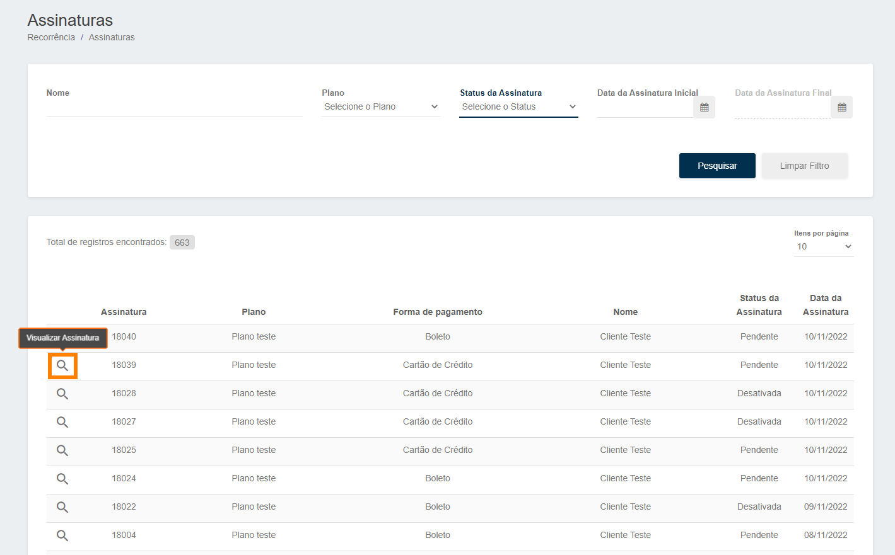

# Gerenciando suas assinaturas

Abaixo vamos mostrar como você poderá ter controle sobre suas assinaturas.

Para isso,você deve acessar o menu de <b>Assinaturas</b>, você pode localizá-lo através do <b>Menu Lateral</b>, logo após clique na aba <b>Recorrência</b> e acesse o menu <b>Assinaturas</b>.

Na tela abaixo é possível <b>identificar</b> todas as assinaturas cadastradas e suas <b>informações</b> como, código da assinatura, plano no qual a assinatura está vinculada, forma de pagamento, status e data da assinatura. 
Caso queira <b>visualizar</b> a assinatura, é só clicar na <b>lupa</b>.

Então abrirá uma aba lateral da tela com <b>todas as informações</b> da assinatura, conforme imagem abaixo.

Caso seja necessário <b>Desativar</b> a assinatura, basta clicar em <b>Cancelar assinatura.</b>

<b>Entendemos que para um melhor gerenciamento de suas assinaturas é importante entender o que significa cada status.</b>
 

<table style="width:575px; Height:100%; border:3px double #002F4D; margin-left: auto; margin-right: auto; border-collapse: collapse;">
<tr><th>Pendente</th><td>Quando ainda não houve identificação de pagamento da assinatura.</td></tr>
<tr><th>Adimplente</th><td>Quando foi identificado o pagamento da assinatura.</td></tr>
<tr><th>Atrasada</th><td>Quando está vencido o pagamento da assinatura.</td></tr>
<tr><th>Inadimplente</th><td>Sempre que o pagamento da assinatura não foi reconhecido.</td></tr>
<tr><th>Encerrada</th><td>Sempre que a assinatura for cancelada ou o ciclo finalizado.
</table>

<my-footer></my-footer>