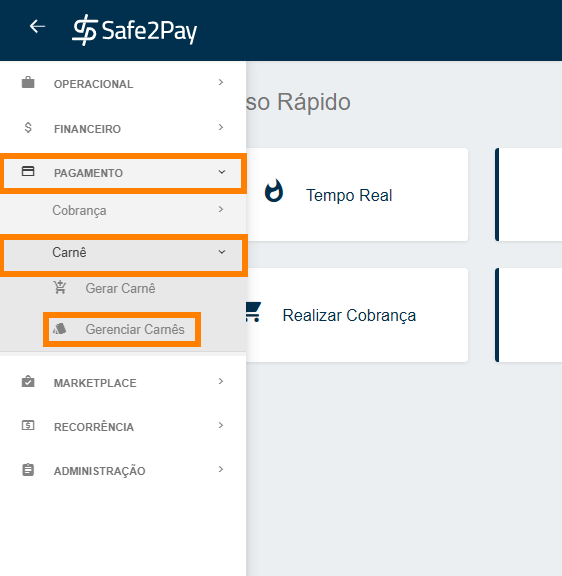
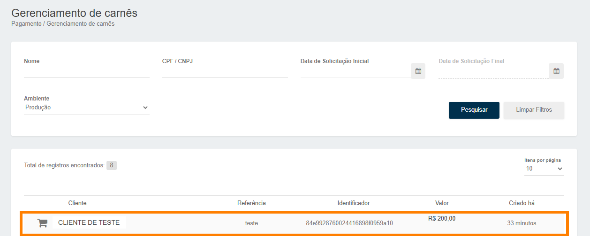
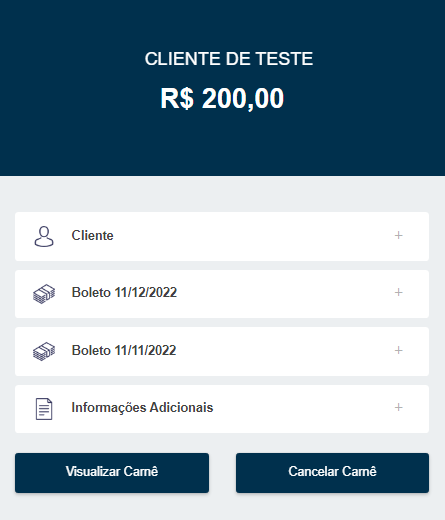

# Gerenciando seus carnês

<b>Não basta sabermos emitir carnês, precisamos gerenciá-los!</b> 
Para isso, no menu lateral, você deve clicar em <b>Gerenciar Carnês</b>.

Após acessar o menu de gerenciamento de carnês, é possível visualizar todos os carnês gerados e suas informações como: <b>cliente, referência, identificador, valor e a data de criação.</b>

Para verificar especificamente um carnê, basta clicar diretamente em cima da cobrança. 
As informações do carnê em questão serão disponibilizadas na tela, conforme imagem abaixo.

<b>Cliente:</b> Nesta opção você terá as informações de seu cliente.

<b>Boletos:</b> Aqui você visualizará todos os boletos que fazem parte do carnê gerado.

<b>Informações Adicionais:</b> Algumas informações adicionais em referência ao carnê gerado. 

<b>Visualizar Carnê:</b> A visualização completa do carnê.

<b>Cancelar Carnê:</b> Este botão cancela todo o carnê.

<my-footer></my-footer>