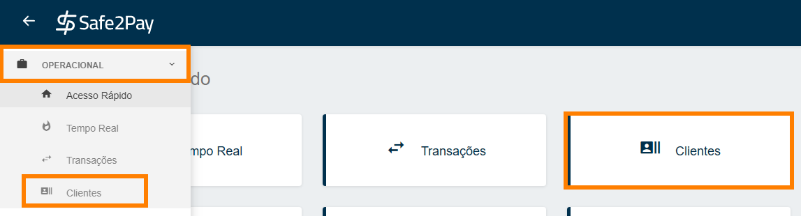
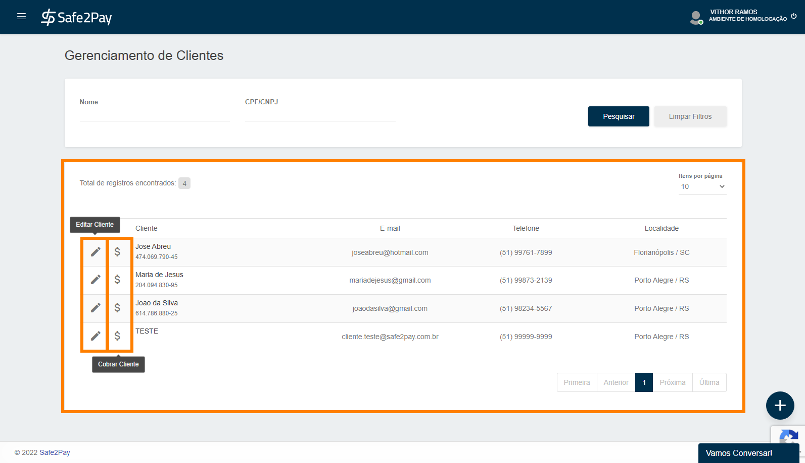
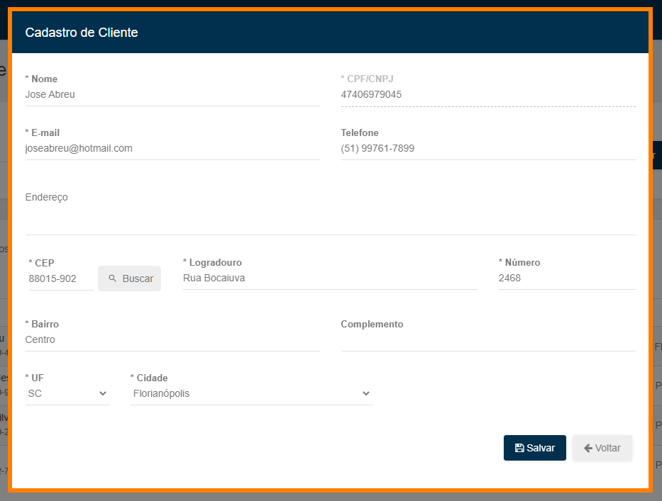
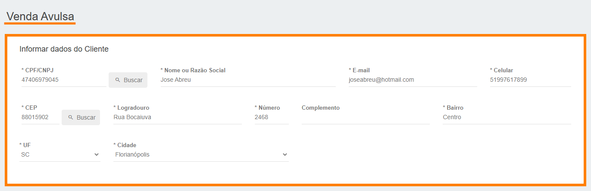

# Gerenciando seus clientes

Agora que já explicamos como realizamos o cadastro dos clientes, vamos aprender a <b>Gerenciá-los</b> em sua conta.

Você pode acessar o menu <b>Clientes</b> através de nosso <b>Acesso Rápido</b> ou através do <b>Menu Lateral</b> acessando a aba <b>Operacional</b>.

Neste ambiente é possível identificar todos os clientes cadastrados na sua conta e suas principais informações, conforme imagem abaixo.

Aqui temos apenas <b>2 opções</b>, você pode editar os dados do cliente clicando no <b>Lápis</b>, além de gerar uma cobrança direto ao cliente selecionado clicando no <b>Cifrão</b> ao lado do nome do cliente. 

Ao clicar para <b>Editar Cliente</b> será aberto a mesma tela do cadastro manual de cliente para você editar as informações do seu cliente.

Caso você queira realizar uma cobrança para o seu cliente, basta clicar em <b>Cobrar Cliente</b> e você será direcionado ao menu <b>Realizar Cobrança</b> onde você poderá gerar uma venda avulsa ao seu cliente, aqui todos os dados de seu cliente selecionado serão preenchidos <b>automaticamente</b>.

<my-footer></my-footer>