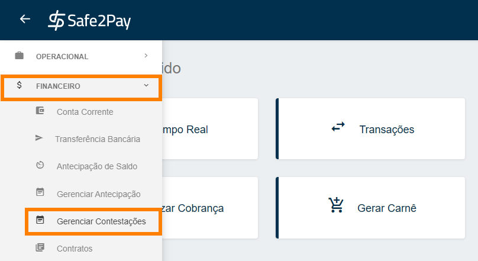
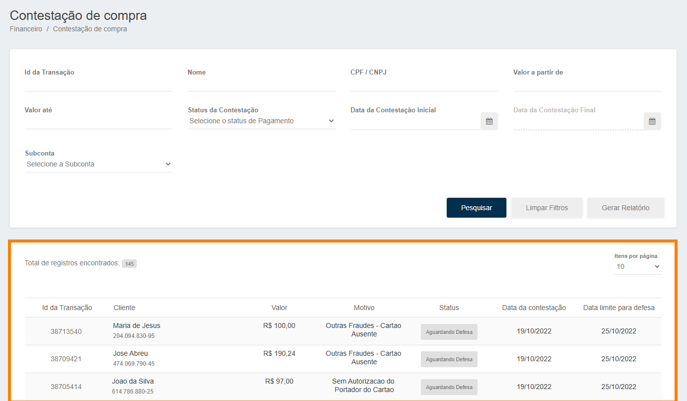
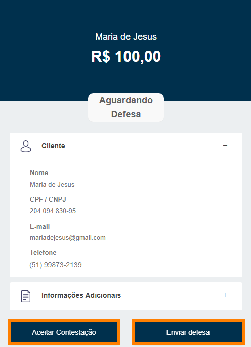
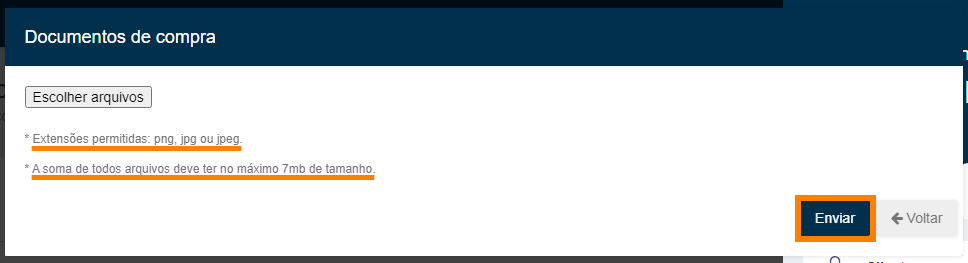

# Localizar contestações

Além de lhe ajudar a localizar suas <b>contestações</b>, explicaremos um pouco sobre como funciona para você realizar a sua <b>Defesa</b>.

Para localizar as suas contestações, você deve acessar o <b>Menu Lateral</b>, abrir a aba <b>Financeiro</b> e logo após <b>Gerenciar Contestações</b>.

Aqui você conseguirá visualizar todas as transações contestadas por seus clientes, além de poder <b>Gerar Relatório</b> referente a todas as contestações, também aplicar alguns <b>Filtros</b> para facilitar a localização de uma transação específica.

Através do <b>Status</b> é possível identificar a situação de cada Contestação:
<table style="border: 3px double #002F4D; margin-left: auto; margin-right: auto; border-collapse: collapse; width: 900px;">
<tr><th>Aguardando defesa</th><td>Aguardando documentos para começar analisar, o estabelecimento tem 06 dias para encaminhar os documentos.</td></tr>
<tr><th>Contestação aceita</th><td>Estabelecimento aceitou a contestação da compra.</td></tr>
<tr><th>Disputa Rejeitada</th><td>Os documentos não foram aceitos pela(o) adquirente/bandeira/banco.</td></tr>
<tr><th>Disputa Aceita</th><td>Os documentos foram aceitos pela(o) adquirente/bandeira/banco, o valor retorna para o estabelecimento.</td></tr>
<tr><th>Disputa iniciada</th><td>Quando os documentos já foram encaminhados.</td></tr>
<tr><th>Prazo Expirado</th><td>Passou do prazo de 6 dias e não é mais possível encaminhar os documentos.</td></tr>
</table>

Após você selecionar a contestação desejada, será aberto um menu na lateral direta com as informações da transação. 
Podendo <b>Aceitar a Contestação</b> ou <b>Enviar Defesa</b>.

<b style="font-size: 20px;">1.</b> Caso você clique em <b>Aceitar Contestação</b>, seu cliente ganhará a contestação e o valor total da transação será devolvido a conta em que ele realizou o pagamento.

<b style="font-size: 20px;">2.</b> Agora, no caso de você ter enviado o produto/prestado o serviço e querer <b>Enviar Defesa</b> para não receber um <b>Chargeback</b>, basta você acessar o link a cima para saber os documento para o envio. 
Com os documentos separados, você deve enviá-los que os documentos serão analisados pela <b>BrasPag</b> com uma previsão de <b>até 120 dias</b> para uma resposta desta contestação, neste período o valor da transação ficará <b>Retido pela bandeira do cartão</b>.

<a target="_blank" href="https://braspag.github.io//manual/risknotification#documentos-para-disputa">Clique aqui para saber os documento para enviar em sua Defesa.</a> 

Caso queira saber mais sobre <b>Chargebacks</b> você pode acessar o Blog da Konduto, onde você terá mais informações sobre o assunto. 
<a target="_blank" href="https://blog.konduto.com/pt/2016/05/por-que-o-lojista-deve-pagar-pelo-chargeback/">Clique aqui e saiba mais.</a>

<my-footer></my-footer>