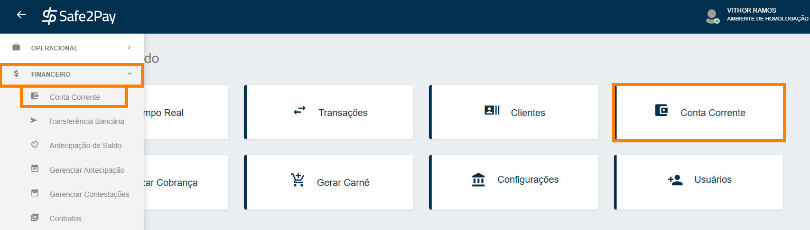

# Gerenciando seus recebimentos

Para gerenciar os seus recebimentos, você deve acessar o menu de <b>Conta Corrente</b>. 
Você pode acessar através de nosso <b>Acesso Rápido</b> ou através do <b>Menu Lateral</b> acessando a aba <b>Financeiro</b>.

Na tela abaixo é possível visualizar e gerar relatórios referentes aos repasses de recebíveis diários, semanais ou mensais.

<b>1.</b> Você pode ver os dados da conta bancária cadastrada para o recebimento do repasse. 
<b>2.</b> Você tem um resumo dos valores a receber e dos descontos de todo o mês em que você se encontra.

Para gerar algum relatório tanto diário quanto mensal basta clicar na <b>"seta"</b> no canto inferior direito da tela.

*No relatório é disponibilizado as seguintes informações: Nome e/ou documento do cliente, valor da taxa cobrada, valor recebido e data do repasse.*

<b>Lembrando que os repasses são realizados da seguinte forma:</b> 
<table style="border: 3px double #002F4D; margin-left: auto; margin-right: auto; border-collapse: collapse; width: 500px;">
<tr><th><b>Forma de Pagamento:</th><th>Previsão do repasse:</th></tr>
<tr><td><b>Pix</b></td><td> O repasse é realizado em D+1.</td></tr>
<tr><td><b>Boleto Bancário</b></td><td> O repasse é realizado em D+2.</td></tr>
<tr><td><b>Bitcoin</b></td><td> O repasse é realizado em D+4.</td></tr>
<tr><td><b>Cartão de crédito à vista</b></td><td> O repasse é realizado em D+31.</td></tr>
<tr><td><b>Cartão de crédito parcelado</b></td><td> D+31, D+62, D+93, e assim sucessivamente.</td></tr>
</table>
<b style="color: #FF7F00;">*Repasses são realizados somente em dias úteis</b>

Ao clicar em algum dia será possível visualizar mais detalhadamente sobre as formas de pagamento dos valores a receber no dia.

<b>1.</b> Neste menu você pode filtrar a forma de pagamento que você deseja visualizar neste menu. 
<b>2.</b> Abaixo, em "Status de Repasse", é possível visualizar alguns status, apresentados logo abaixo. 
<b>3.</b> Aqui você verá os detalhes dos valores a receber no dia em que você entrar. 
<b>4.</b> Nesta parte irá aparecer todas transações aprovadas para serem repassadas neste dia. 

<b>Status possíveis no repasse:</b> 
<table style="border: 3px double #002F4D; margin-left: auto; margin-right: auto; border-collapse: collapse; width: 715px;">
<tr><th>Status Depositado</th>
<td>Quando a Safe2pay repassou o valor para conta cadastrada no painel.</td></tr>
<tr><th>Status Previsto</th>
<td>Quando o valor está previsto para ser depositado pela Safe2Pay na sua conta.</td></tr>
<tr><th>Status Devolvido</th>
<td>Quando a Safe2Pay não conseguiu realizar o depósito na conta do usuário cadastrada.</td></tr>
</table>

<b style="color: #FF7F00;">*IMPORTANTE: Quando o status apresentado for devolvido é importante conferir se a conta bancária cadastrada tem vínculo com o CNPJ do perfil, e se está correta.</b>

<my-footer></my-footer>