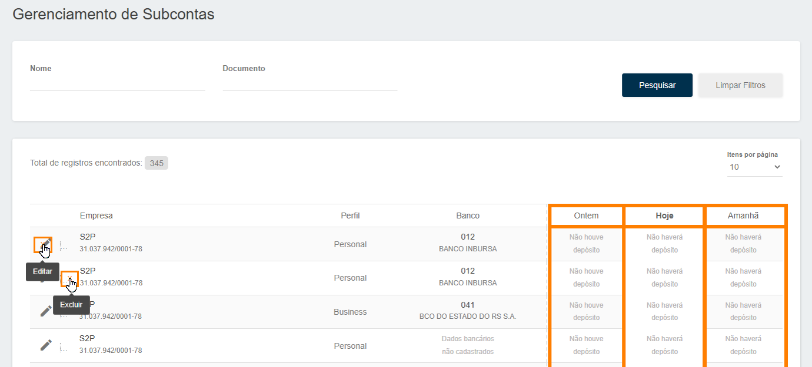

# Gerenciando Subcontas

A seguir, demonstraremos como você poderá gerenciar as suas <b>Subcontas</b>. 

Para isso você deverá acessar o menu <b>Marketplace</b> e logo após acessar o menu <b>Gerencias Contas</b>, conforme apresentamos na imagem abaixo.

Na tela abaixo é possível identificar <b>todas</b> as Subcontas cadastradas.
 
Podendo visualizar os valores <b>Repassados "Ontem"</b>, o valor <b>Depositado "Hoje"</b> e o valor que esta <b>Previsto para "Amanhã"</b>.
 
Além de poder <b>Editar</b> ou <b>Excluir</b> uma Subconta específica.

*Contas excluídas podem ser cadastradas novamente.*

<my-footer></my-footer>