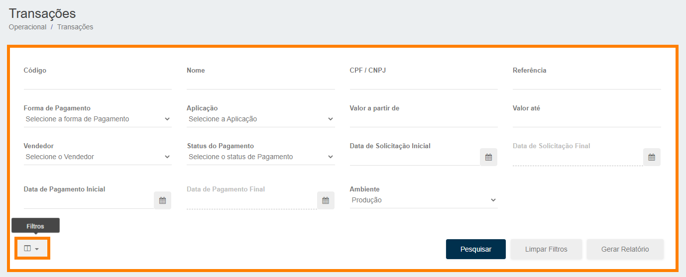
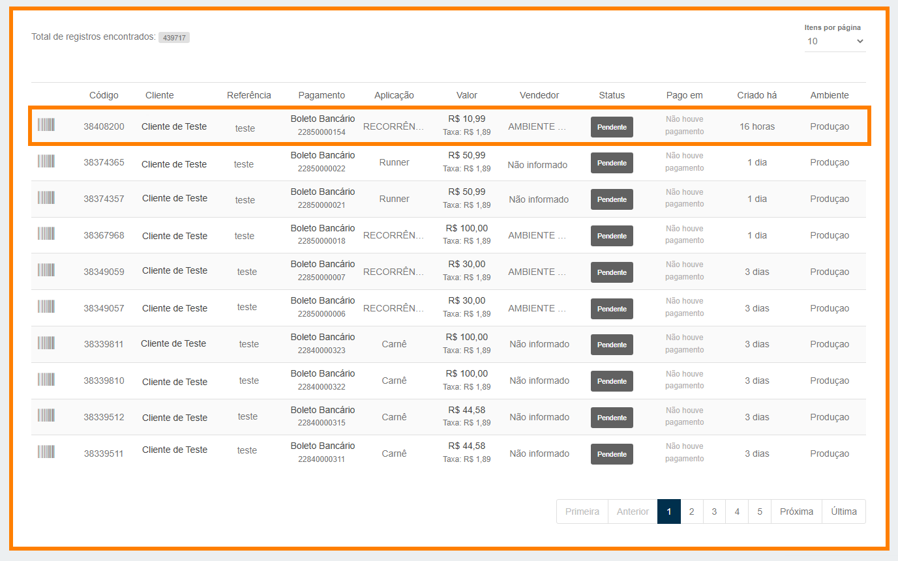
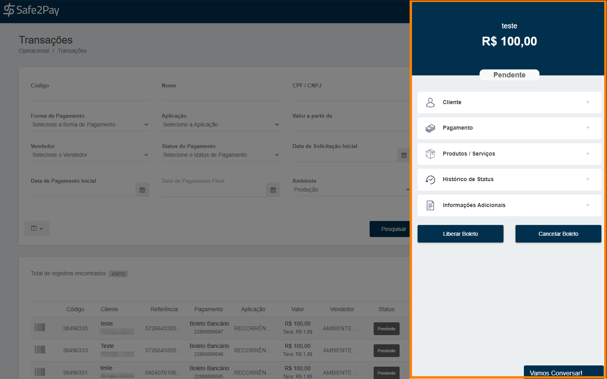

# Gerenciando suas transações

Para gerenciar suas transações, você deve acessar o menu <b>Transações</b> através do menu de <b>Acesso Rápido</b> ou através do <b>Menu Lateral</b> acessando a aba <b>Operacional</b>.

Ao acessar a página de transações, a primeira opção que temos é para realizar uma pesquisa utilizando os <b>filtros</b>.

Clicando na opção de <b>"filtros"</b> você terá algumas opções para a filtragem das transações:

<table style="border: 3px double #002F4D; margin-left: auto; margin-right: auto; border-collapse: collapse; width: 610px;">
<tr><th>Código</th><td>Aqui você deverá informar o <b>ID</b> da transação.</td></tr>
<tr><th>Cliente</th><td>Aqui você pode informar o <b>Nome</b> ou o <b>CPF/CNPJ</b> de seu cliente.</td></tr>
<tr><th>Referência</th><td>Aqui você irá informar a <b>Referência</b> que você informou a transação.</td></tr>
<tr><th>Forma de Pagamento</th><td>Aqui você seleciona a <b>Forma de Pagamento</b> desejada em seu filtro.</td></tr>
<tr><th>Aplicação</th><td>Muitas vezes é utilizado o <b>ERP</b> do serviço para o filtro.</td></tr>
<tr><th>Valor</th><td>Em valor você pode filtrar <b>Valor a partir de</b> e <b>Valor até</b>.</td></tr>
<tr><th>Vendedor</th><td>Caso Tenha informado um <b>Vendedor</b> quando você gerou venda.</td></tr>
<tr><th>Status</th><td>Aqui você pode filtrar pelo <b>Status</b> da transação.</td></tr>
<tr><th>Data de Pagamento</th><td>Aqui você pode filtrar pela <b>Data</b> que a transação foi <b>Paga</b>.</td></tr>
<tr><th>Data de Solicitação</th><td>Aqui você pode filtrar pela <b>Data</b> de <b>Geração</b> da cobrança.</td></tr>
<tr><th>Ambiente</th><td>Além de poder filtrar entre os <b>Ambientes</b> de <b>Sandbox</b> e <b>Produção</b>.</td></tr>
</table>

<b style="color:#FF7F00;">*Recomendamos utilizar o botão Limpar Filtro antes realizar alguma pesquisa, não se esqueça de apagar a data que será aplicada, após limpar o filtro.</b>

Neste ambiente ainda é possível identificar todas as transações realizadas na sua conta, conforme imagem abaixo.

Ao clicar sobre uma transação, aparecerá uma janela lateral com todas as informações daquela transação, assim como ações que podem ser realizadas.

<my-footer></my-footer>