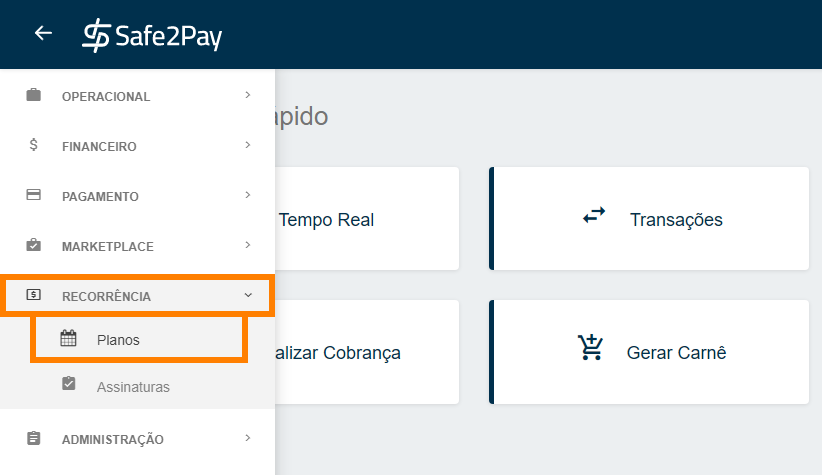
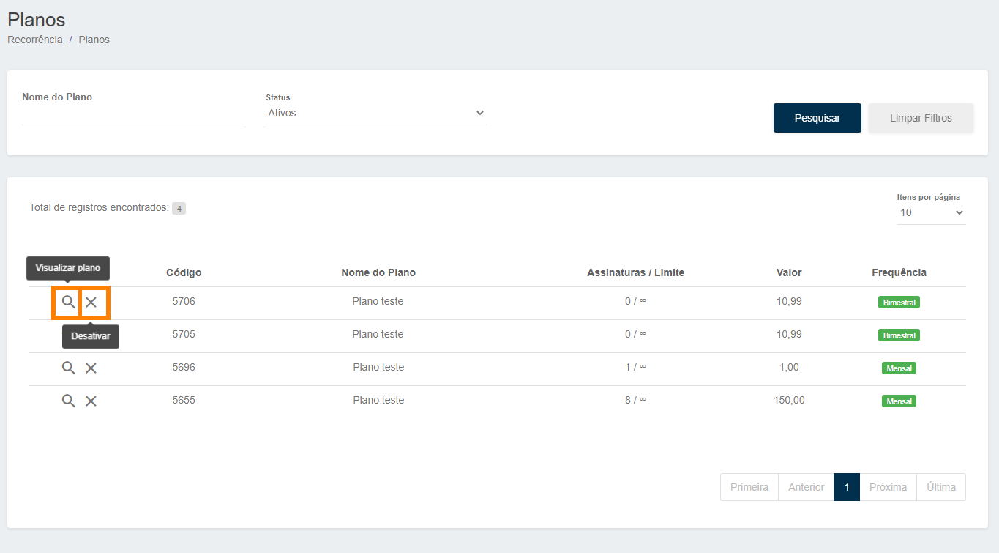
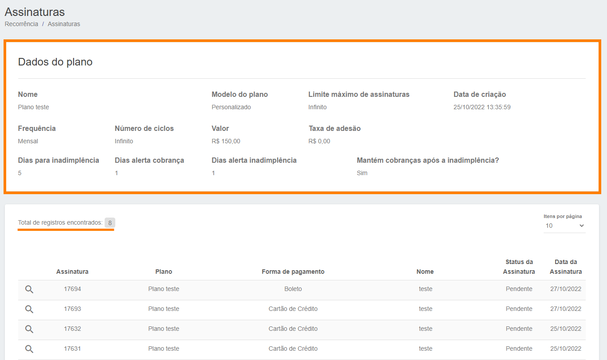

# Gerenciando seus planos de recorrência

Abaixo vamos mostrar como você poderá ter controle sobre os seus <b>Planos Criados</b>. 
Para isso siga o caminho da imagem abaixo e acesse o menu de <b>Planos</b> dentro da aba de <b>Recorrência</b>.

Na tela abaixo é possível identificar <b>todos os planos cadastrados</b> e suas informações como, código do plano, nome do plano, quantidade de adesões e o limite, valor do plano e o intervalo.

<b>Para visualizar as adesões de cada plano</b>, basta clicar na <b>Lupa</b>. 
<b>Para desativar um plano cadastrado</b>, basta clicar no <b>X</b>.

Caso clique na <b>Lupa</b>, você poderá visualiza os <b>dados do plano</b> e todas as <b>assinaturas vinculadas</b> ao plano selecionado, assim como na imagem abaixo:

<my-footer></my-footer>