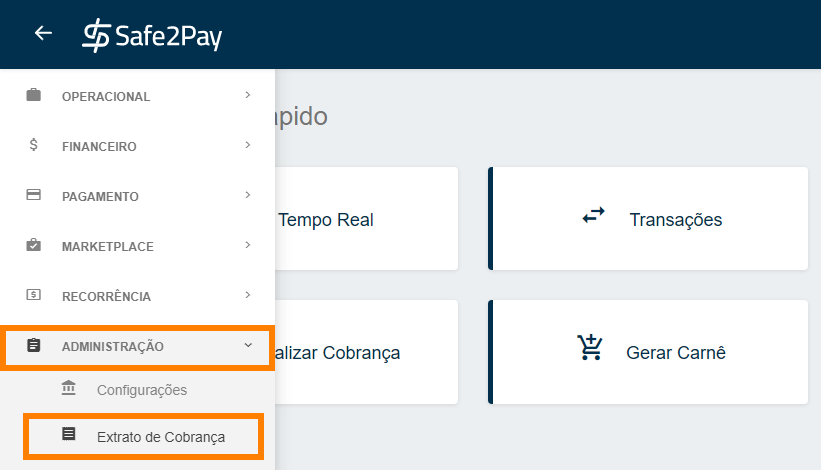
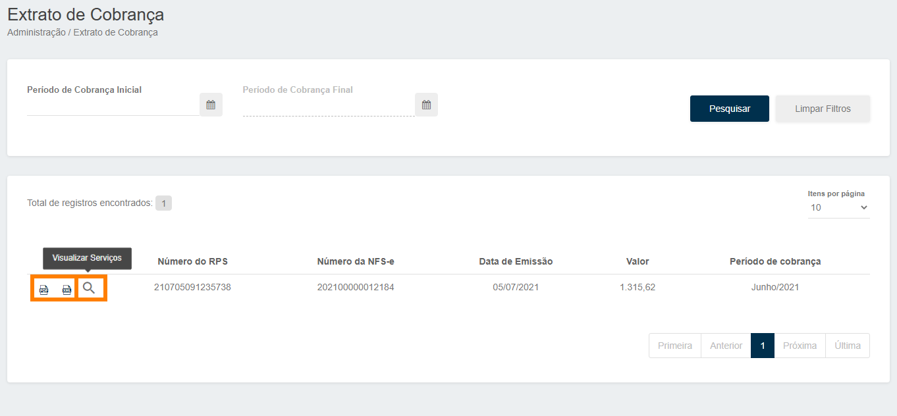

# Notas fiscais de serviço (NFS-e)

Chegou a hora de realizar a conciliação bancária? 
Para você ter acesso às <b>Notas Fiscais das taxas cobradas pela Safe2Pay</b>, basta seguir este passo a passo:

Em Menu, você deve clicar em <b>Administração</b> e depois em <b>Extrato de Cobrança</b>.

Caso você queira identificar todas as <b>Taxas Cobradas na NF pela Safe2Pay</b>, basta clicar na <b>Lupa</b>.

<b style="color: #FF7F00;">IMPORTANTE: Essas NFS-e podem ser exportadas em pdf ou xml, basta clicar no ícone do arquivo desejado.</b>

<h3>Mas estas notas fiscais são referentes há quê?</h3> 
Estas notas fiscais que enviamos há vocês <b>(nossos clientes)</b> são referentes há todo valor de <b>taxas serviço utilizado</b> em nossa plataforma. 
<b style="font-size:17px">Por exemplo:</b> As taxas de transações, taxa do Anti-fraude, serviços de SMS, Antecipação, etc... 

*Observação: No caso de realizar uma venda no cartão de crédito parcelado, será lançado o valor total de todas as parcelas no mês da criação da cobrança.*

<my-footer></my-footer>