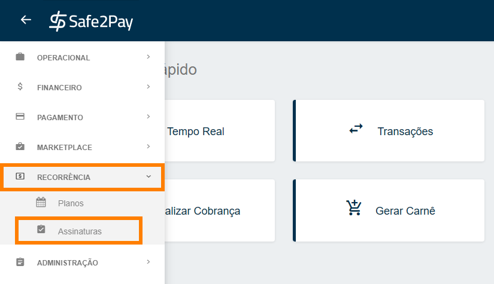
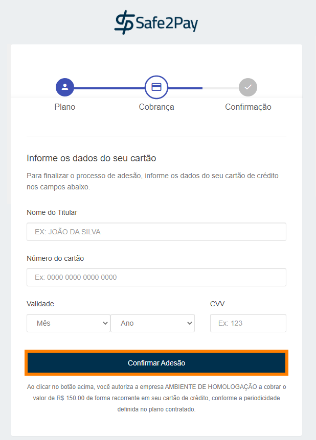

# Criando e Incluindo assinatura há plano recorrente

Abaixo vamos mostrar como <b>Criar</b> uma assinatura e <b>Incluí-la</b> à seu plano de recorrência.

Primeiro será necessário acessar o menu de <b>Assinaturas</b>, para isto abra o <b>Menu Lateral</b>, logo após clique na aba <b>Recorrência</b> e acesse o menu <b>Assinaturas</b>.

A seguir será necessário clicar no símbolo de <b style="font-size: 17px;">(+)</b>, no canto inferior direito da tela, conforme imagem abaixo. 

Agora será necessário preencher <b>todas as informações da assinatura</b>.

As primeiras informações solicitadas aqui são os <b>Dados do cliente</b>. 
Caso você informe o <b>CPF/CNPJ</b> de um <b>cliente já cadastrado</b> em sua conta, e clicar em <b>Buscar</b> os dados deste cliente será preenchido <b>automaticamente</b>.

<b style="color:#FF7F00;">Atenção: Todos os campos com (*) são obrigatórios.</b>

Abaixo é possível identificar que o próximo preenchimento é a escolha do <b>Plano</b>.

Primeiramente você deverá selecionar um <b>Plano</b>, portanto ao clicar na seta aparecerão todos os planos já cadastrados com suas <b>nomenclaturas definidas</b>. 
Ao selecionar o <b>Plano</b>, as demais informações deste campo são <b>preenchidas automaticamente</b  >.

Agora você definirá a <b>Formas de pagamento</b>.

Esta será a forma de pagamento da <b>Assinatura</b> no <b>Plano</b> informado.

No caso de querer o pagamento em <b>boleto</b>, é só selecionar a forma de pagamento e informar <b>o e-mail</b> ou <b>os e-mails</b> que precisam receber esta cobrança. 
Na opção de <b>Cartão de Crédito</b> não é necessari nenhuma informação a mais.

<select onchange="document.getElementById('preview').src = this.value" style="display:block; margin-left: auto; margin-right: auto; height: 30px; border-style:none none solid none; border-color: #002F4D;">

<option hidden>Selecione a forma de pagamento:</option>
<option value="../imagens/formaBol02.png">Boleto</option>
<option value="../imagens/formaCard02.png">Cartão de Crédito</option>
</select> 

Após configurar a sua assinatura, clique em <b>Salvar</b>, conforme a imagem abaixo.

Aqui será apresentada uma <b>prévia da assinatura</b> e suas cobranças, se tudo estiver correto, você deverá confirmar a adesão, para isso clique em <b>Salvar</b>.

Ao finalizar a criação da sua assinatura, aparecerá em sua tela uma mensagem informando a conclusão.

<table>
<th style="border: 3px double #002F4D">Conclusão da forma de pagamento Boleto:</th>
<th style="border: 3px double #002F4D">Conclusão na forma de pagamento Cartão:</th>
</table>

<b style="color:#FF7F00">IMPORTANTE: O link de checkout estará disponível na tela de conclusão da assinatura, e pode ser encaminhado para o cliente sempre que solicitado.</b>

<b>Boleto:</b> Caso a forma de pagamento selecionada na assinatura seja boleto, assim que finalizar seu cliente receberá os boletos em seu e-mail nas <b>datas de envio</b> informadas na conclusão da assinatura.

<b>Cartão de crédito:</b> Agora caso a forma de pagamento ecolhida seja cartão de crédito, neste momento o assinante receberá no seu e-mail o link para incluir os seus dados de cartão e ativar sua assinatura, também chamado <b>link de checkout</b>.

Nesta imagem abaixo é possível verificar como será o e-mail que o assinante receberá para confirmar sua assinatura.

Estando tudo certo, é só clicar em <b>Continuar para cobrança</b>.

A seguir será solicitado ao cliente os dados do seu cartão de crédito para então aderir a assinatura.

Incluído os dados é só clicar em <b>Confirmar Adesão</b>.

E então o cliente receberá a confirmação da sua assinatura.

<my-footer></my-footer>