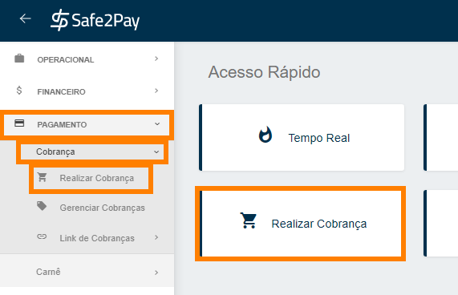

# Realizando uma cobrança

<b>Se cadastrou e ainda não sabe como realizar uma cobrança?</b>
 
Há, na verdade, dois tipos de venda: venda avulsa e a venda recorrente. Aqui abordaremos a primeira delas.

Para criar uma <b>venda avulsa</b> (<b>ou rápida</b>), será necessário:

Você pode entrar diretamente através do <b>Acesso Rápido</b> ou então seguindo o caminho, <b>Menu Lateral</b>, acesse o menu <b>Pagamento</b>, siga para <b>Cobrança</b> e selecione a aba <b>Realizar Cobrança</b>.

No primeiro momento você irá informar os <b>dados</b> de seu cliente no qual você deseja realizar a venda. 
Caso você já tenha o seu cliente cadastrado, ao adicionar o <b>CPF</b> do mesmo os outros dados serão preenchidos automaticamente.

<b style="color: #FF7F00;">Vale lembrar que todos os campos com (*) são obrigatórios.</b>

<b>Informação da venda:</b> Aqui você pode informar uma referência referente a venda para uma facilitação na hora do gerenciamento.

<b>Desconto:</b> Caso queira, você pode declarar um valor para o desconto e uma data limite para este desconto ser aplicado.

<b>Enviar cobrança por e-mail:</b> Caso seu cliente seja cadastrado, ao habilitar a opção de envio, automaticamente o e-mail do cliente aparecerá neste campo.
E ainda é   possível incluir mais de um e-mail para recebimento da cobrança, para isso separe os e-mails por (;).

<b>Enviar cobrança por SMS:</b> Caso seja de sua preferência, você encaminhar a cobrança diretamente para o celular de seu cliente de forma bem pratica, <b>este serviço tem uma taxa de R$0,20</b>.

<b>Informar data da expiração da cobrança:</b> Assim que a data de expiração for atingida, a venda expirará e não será capaz de receber pagamento mais.

<b>Itens da cobrança:</b> Aqui você irá descrever o produto/serviço que você está vendendo, a quantidade do produto e o valor unitário. Depois, basta clicar em <b>Adicionar</b> no canto lateral direito.

Logo abaixo terá as <b>formas de pagamentos</b> para você selecionar as que você deseja aplicar nesta venda.

A Primeira forma de pagamento é o <b>Boleto</b>:

Após habilitar esta opção irá abrir uma janela para configurar algumas informações para você adicionar ao boleto, apenas a <b>*Data de Vencimento da Venda</b> é obrigatória, além disso, você poderá informar alguma <b>instrução</b> ou <b>mensagem</b> no boleto e se irá cobrar <b>multa</b> e/ou <b>juros após o vencimento</b>.

A Segunda forma de pagamento é o <b>Cartão de Crédito</b>:

Ao habilitar a opção de cartão de crédito você poderá informar o <b>número de parcelas</b>, e também aplicar <b>juros</b>, caso desejado.

As demais formas de pagamento, como <b>Criptomoeda, Cartão de Débito e PIX</b>, podem se habilitadas ou desabilitadas conforme sua necessidade, sem precisar preencher demais dados.

Para enviar a cobrança você deve clicar no ícone do <b>"Aviãozinho de papel"</b>.

Após finalizar a cobrança, você tem duas opções: <b>fechar</b> e finalizar o processo ou clicar em <b>Exibir Cobrança</b>. 
Ao clicar em <b>exibir a cobrança</b>, você será direcionado ao link com o resumo da cobrança e as suas opções de formas de pagamento.

*Observação: Esse será o mesmo link de cobrança que o cliente receberá.*

<my-footer></my-footer>