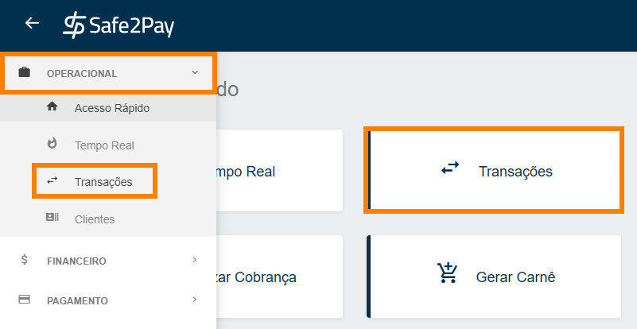

# Relatórios de transações

Aqui mostraremos como você poderá gerar relatório das suas transações. 
Primeiro você deverá acessar o menu <b>Transações</b> através do atalho no <b>Acesso Rápido</b> ou através do <b>Menu Lateral</b> acessando a aba <b>Operacional</b>.

Agora você pode aplicar algum filtro para lhe ajudar a localizar as transações desejadas, logo após clique em Gerar Relatório.

Assim que você clicar parar gerar o relatório será realizado o download do Relatório em formato Excel no seu equipamento.

<b>Exemplo:</b>

<b style="color: #FF7F00">*Lembrando que no relatório serão mostradas apenas informações das transações encontradas no filtro aplicado.</b>

<my-footer></my-footer>