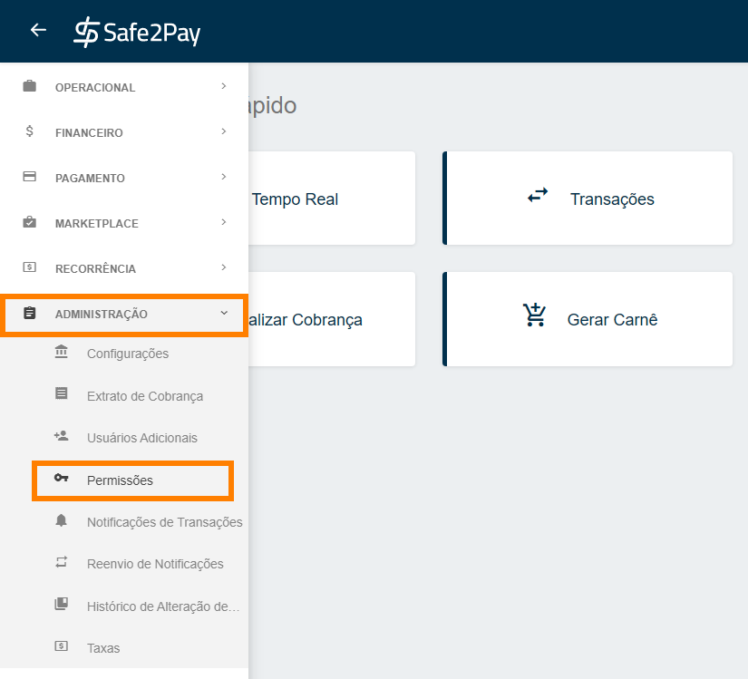
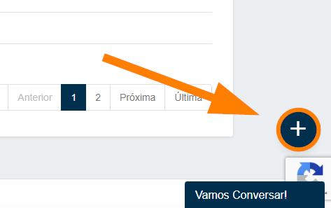
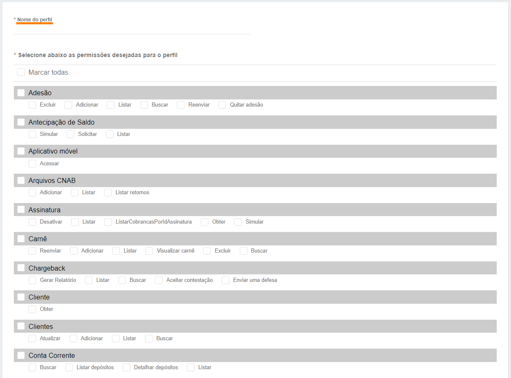
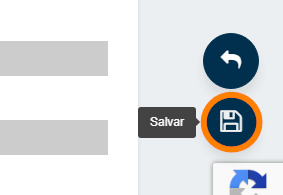

# Perfis de usuários personalizados

Caso você tenha visualizado os perfis de usuários padrões e nenhum atenda as suas necessidades, está no lugar certo!

Para criar um perfil personalizado você deverá acessar o menu <b>Permissões</b> através do <b>Menu Lateral</b>, acessando a aba <b>Administração</b>.

A seguir, será necessário clicar no símbolo de <b style="font-size: 17px;">(+)</b> no canto inferior direito da tela, conforme imagem abaixo.

Agora, o sistema solicitará para definir um nome para este perfil na criação do perfil personalizado. 
Logo abaixo, você poderá definir as permissões de acesso clicando nos Checkbox de preferência, conforme imagens abaixo.

*Existem várias outras permissões a serem exploradas para que o seu perfil personalizado atenda  suas necessidades da forma desejada.*

Caso você queira <b>habilitar todas os acessos</b>, basta selecionar a opção Marcar todas e, então, o sistema marcará automaticamente. 
Entretanto, caso você queira selecionar <b>somente acessos específicos</b>, basta clicar no Checkbox correspondente.

<b style="color: #FF7F00">*IMPORTANTE: O que for definido agora serão as permissões que este usuário terá ao acessar o sistema com o seu login e senha.</b>

Ao concluir as liberações para este perfil, é só clicar para <b>Salvar</b> no canto inferior direito da tela.

Ao finalizar o processo, aparecerá em sua tela uma mensagem informando a conclusão.

 

<b style="font-size: 25px;">Agora pronto, seu perfil personalizado está pronto para uso.</b>

<my-footer></my-footer>