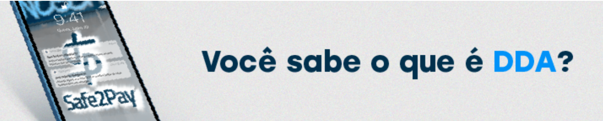

# Recebeu um boleto em seu DDA?

# Fica tranquilo que a gente te explica o motivo!

<b>Mas afinal, o que é DDA?!</b>

O <b>DDA</b> ou <b>Débito Direto Autorizado</b>, resumidamente, é um sistema para você receber seus boletos de modo digital e descomplicado.

Se você possui o DDA ativo, poderá visualizar em sua conta bancária todas as cobranças destinadas a você ou a sua empresa.

Nós, Safe2Pay, somos uma intermediadora de pagamentos. Ou seja, realizamos e recebemos cobranças em nome de nossos clientes. Por esse motivo, você pode receber alguma cobrança em nome da Safe2Pay mesmo sem nos conhecer.

Mas pode ficar tranquilo! Estamos aqui justamente para garantir a sua segurança no momento do pagamento.

Para verificar quem gerou essa cobrança para você, disponibilizamos em nosso site uma consulta! <a target="_blank" href="https://safe2pay.com.br/ajuda/consulta-dda">Basta clicar aqui!</a>

Caso ainda assim você não reconheça do que se trata, solicitamos a gentileza de entrar em contato diretamente com empresa responsável.

<my-footer></my-footer>